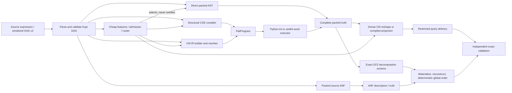
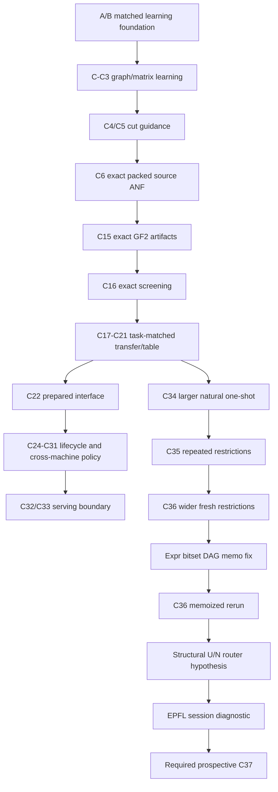

# CM Computation: Deep Technical Reconstruction and Research Dossier

**Reconstruction date:** 2026-09-02  
**Repository:** `CM_Computation`  
**Observed HEAD:** `17d0a1403c9e642a1ed5854db13f685e83fe57c3` (`17d0a14`, “Freeze P7 W5 and record first IR shard,” 2026-09-01)  
**Purpose:** technical continuity for the mathematical CM implementation, exact backends, decomposition research, performance experiments, and prospective routing work.

This document distinguishes seven evidence qualities throughout: **REPRODUCED**, **DIRECT SOURCE EVIDENCE**, **DERIVED FROM RESULTS**, **DOCUMENTATION CLAIM**, **HISTORICAL**, **INFERRED**, and **UNRESOLVED**. “Current” means the executable working-tree state inspected on 2026-09-02. “Frozen” means the behavior represented by a source snapshot or hash-bound experiment artifact, which can differ from current code.

---

## 1. Executive technical state

The project has two related but non-identical meanings of “CM.” The mathematical Correspondence Matrix is a Boolean relation over ordered valuation bases. The repository’s **CM IR** is an interned, canonicalizing Boolean-operation DAG used as a compiler/intermediate representation. Dense CM arrays and packed truth vectors are materializations of a Boolean function; CM IR is not itself the (2^{|R|}\times2^{|C|}) matrix. **DIRECT SOURCE EVIDENCE:** `cm_lm.py`, `cm_operator_difference.py`, `cm_build.py`, `cm_normalize.py`, and `cm_ir.py:477-495` (`CMNode`).

The current exact execution frontier is workload-dependent:

| Workload regime | Fastest supported conclusion | Evidence quality |
|---|---|---|
| C34 one-shot complete vectors, natural Yosys, support 3–10 | Direct AST packed-bit evaluation won all 48 cases | **DERIVED FROM RESULTS** — `docs/recognition/learning_milestone_c34_natural_headroom_results.json` |
| C35 resident restrictions, 64 queries, support 3–10 | Sharing-aware flattened CSE was best fixed; CM beat direct AST but not CSE | **DERIVED FROM RESULTS** — C35 result/report |
| Frozen C36, 64 restrictions, support 11–16 | Flattened CSE was best fixed at 125.454 ms aggregate | **HISTORICAL** — frozen C36 result/report |
| Current memoized C36 rerun, same task | Compiled full-truth projection is best fixed at 119.956 ms; CSE is 122.812 ms | **REPRODUCED / DERIVED FROM RESULTS** — memoized run artifact |
| Current memoized C36 per-case choice at q64 | Four multiply-low-cone cases choose projection; the other 14 choose direct AST; raw oracle 83.846 ms | **DERIVED FROM RESULTS** |
| C16 exact decomposition on its Windows cohort | Screen-then-materialize is 3.55× faster than exhaustive materialization and returns the byte-identical best artifact | **DERIVED FROM RESULTS** — C16 result/report |
| C21 global-best bounded partition table | Cheap ranking/proposal cannot avoid completion under the frozen “enumerate all exact candidates, return deterministic global best” contract | **DERIVED FROM RESULTS**, formulation-specific |

The most consequential current code change is a per-call identity memo in `eval_expr_bitset`. Before it, recursive evaluation followed every incoming reference to a shared expression node and therefore performed work proportional to the tree unfolding (U), not unique DAG nodes (N). The current evaluator computes each object identity once per call. **DIRECT SOURCE EVIDENCE:** `bitset_backend.py:60-98`; regression: `tests/test_bitset_backend.py:25-44`. This fix is present in the working tree but not committed at the observed HEAD.

The memoized C36 rerun changes the routing landscape but is not a clean cryptographic before/after experiment. The run is internally verified, yet its manifest omits `bitset_backend.py` and other transitive performance dependencies. Its improvement is consistent with, and directly targeted by, memoization because compiled projection builds its full truth through `eval_expr_bitset`; the artifact alone does not prove that causality. **REPRODUCED:** `docs/recognition/runs/c36-wide-repeated-windows-20260902-memoized-001/independent_verification.json`. **UNRESOLVED:** causal effect separated from machine/run noise.

A cheap structural feature, (D=U/N), cleanly separated the four pathological multiply cases in C36 development at a manually chosen threshold (D>10). A later session-only EPFL diagnostic reported a 1.1774× improvement over the best of two included fixed baselines. It is promising, but it is not C37: no durable artifacts, source hashes, frozen protocol, complete fixed-baseline set, or independent verifier were saved. The same EPFL project corpus had already influenced development. **HISTORICAL**, not presently reproducible.

No learned model has earned production authority. Exact checks remain mandatory, no C36 or diagnostic policy was promoted, and several neural/ranking programs are negative under their measured contracts. Packed source ANF and C16 screening are real exact algorithmic advances; the main current opportunity is a formally frozen, prospective routing experiment whose selection cost and fallback are charged.

---

## 2. Repository and Git snapshot

### 2.1 Observed revision and history

**REPRODUCED:**

- HEAD: `17d0a1403c9e642a1ed5854db13f685e83fe57c3`.
- Recent milestone commits include `e4b35ae` (preserve C16), `4182502` (comparative P6/P7 evidence), `b1e59e5` (C30 prepared lifecycle), `768e00f` (C31 replication), `88d21a6` (C32 shadow boundary), and `17d0a14` (P7 W5/IR shard).
- C34–C36 source, reports, tests, and datasets were untracked in the inspected working tree. Their machine artifacts exist, but they were not part of HEAD.
- The current bitset memoization change and its regression test were modified but uncommitted.

### 2.2 Working-tree ownership and state

The tree was already dirty. This reconstruction did not revert or absorb unrelated work. At triage, modified paths included `bitset_backend.py`, `docs/recognition/LEARNING_ROADMAP.md`, `docs/recognition/experiment_register.json`, `tests/test_bitset_backend.py`, and four historical package-drift tests. Numerous C33–C36 modules, scripts, tests, data files, reports, and unrelated video-factory assets were untracked.

This matters scientifically: “current executable behavior” cannot be equated with HEAD, and an untracked report cannot be attributed to a commit without a separate manifest. Git history establishes chronology for committed milestones, while working-tree inspection establishes live behavior.

### 2.3 Repository areas relevant to computation performance

| Area | Role |
|---|---|
| Root `cm_*.py`, `bitset_backend.py` | Boolean AST, serialization, mathematical CM helpers, CM IR/compiler, dense and packed evaluators |
| `cmbench/backends/` | Runtime engine selection |
| `cmbench/comparative/` | Exact task contracts, balanced schedules, C34–C36 adapters and experiments |
| `cmbench/recognition/` | Features, exact ANF/decomposition, routing and learning experiments, datasets |
| `scripts/` | Experiment entry points, dataset preparation, independent verification, native probes |
| `tests/` | Unit, contract, schedule, tamper, exactness, and experiment replay tests |
| `docs/recognition/` | Roadmap, milestone reports/results, frozen datasets, confirmations, run artifacts |
| `docs/audits/` and `docs/research/` | Earlier performance audits, source snapshots, reproducibility packages |
| `deliverables_n22_24/` | Reused EPFL-derived corpus records |
| `Correspondence_Matrices/` and `docs/CM-Comparisons-Draft.pdf` | Mathematical/retrospective CM documentation |

### 2.4 Priority when evidence conflicts

This dossier uses: current executable code for current behavior; frozen source hashes/snapshots for historical behavior; machine-readable results for measurements; reports; roadmap; then prior narrative summaries. A current rerun does not rewrite a historical report, and a historical report does not describe a later uncommitted evaluator.

---

## 3. Evidence methodology

The reconstruction used targeted inventory, call-site/import tracing, symbol-level source inspection, Git history/status, machine-result recomputation checks, focused tests, and inspection of the original paper and local retrospective deck. It did not treat documentation claims as executable facts.

### 3.1 Evidence map

| Subject | Primary source | Tests | Experimental evidence | Confidence |
|---|---|---|---|---|
| Mathematical CM / LM | `cm_lm.py`; `cm_operator_difference.py`; `Correspondence_Matrices/Readme.md`; 2018 paper | CM operator/LM tests | `docs/CM-Comparisons-Draft.pdf` | High for repository convention; medium for mapping all paper terms to current code |
| Dense generalized CM | `cm_build.py`; `cm_normalize.py` | normalization/build tests | legacy comparisons | High |
| CM IR | `cm_ir.py`; `bitset_backend.py:322-486` | IR/canonicalization/cache tests | audit profiles, C34–C36 | High |
| Direct/flat/CSE packed truth | `bitset_backend.py` | `tests/test_bitset_backend.py` | C34–C36 | High |
| Packed ANF | `source_anf_hybrid.py` | `test_source_anf_hybrid.py`, Yosys ANF tests | C6–C8 | High |
| Exact decomposition/screens | `gf2_decomposition.py` | `test_gf2_decomposition.py` | C15/C16/C21 | High |
| Neural C5 | `natural_variable_cut_experiment.py`, model modules | neural tests in Torch environment | C5 artifacts/report | High for recorded cohort; low for generalization |
| C6 exact ANF | `source_anf_hybrid.py` | ANF tests | C6 artifacts/report | High |
| C21 ranking conclusion | comparative/decomposition table experiment | comparative tests | C21 artifacts/report | High under frozen global-best contract |
| C34–C36 | corresponding comparative modules | C34–C36 tests | reports/results and memoized run | High, except rerun transitive-source provenance |
| Structural router | no durable module/artifact found | none | session observations only | Low / historical |
| Verification | `contracts.py`, verifier scripts | tamper and replay tests | independent-verification JSON | High for enumerated checks |
| Corpora/provenance | dataset builders and JSON inventories | dataset validation tests | dataset verification JSON | Varies by corpus and exposure |

### 3.2 What was reproduced in this reconstruction

- **REPRODUCED:** focused exact suite: 35 passed in 8.43 seconds covering bitsets, C16 decomposition, exact decomposition contracts, and C34–C36 adapters.
- **REPRODUCED in the immediately preceding performance investigation:** 1,193 non-neural tests passed with four warnings and 1,127 subtests; seven neural-oriented files were excluded because the default `.venv` lacks Torch.
- **REPRODUCED:** memoized C36 run artifacts exist and its independent verifier records zero mismatches across 18 cases, 1,152 replayed semantic queries, 72 contracts, 576 measurement rows, and 36,864 timed queries.
- **DERIVED FROM RESULTS:** all performance tables were recomputed/read from machine JSON where available, not transcribed solely from prose.

### 3.3 Evidence limitations

The local `docs/CM-Comparisons-Draft.pdf` is a retrospective slide deck, not a formal proof. The originating paper was inspected for its basis/statevector/LM definitions. The session-only EPFL router measurement lacks saved output. Some live C34–C36 files are untracked. The default environment cannot execute the neural tests. No memory profiler was run for this dossier. Local timing remains machine-specific.

---

## 4. Mathematical definition of CM

### 4.1 Binary Correspondence Matrix

For Boolean variables (X,Y\in\{0,1\}), choose an ordered two-state basis. In the repository’s default `x_first` convention,

\[
|X\rangle=\begin{bmatrix}X\\ \neg X\end{bmatrix},
\qquad
\langle X|=\begin{bmatrix}X&\neg X\end{bmatrix}.
\]

A (2\times2) Boolean matrix \([\Theta]\) encodes a binary operator. Its value is the selected entry

\[
\Theta(X,Y)=\langle X|[\Theta]|Y\rangle,
\]

where ordinary multiplication plus OR, or multiplication plus XOR, agrees on one-hot Boolean statevectors because exactly one row/column pair is selected. The paper’s logical-measurement expression can be written

\[
[M_{X\Theta Y}]=\sum_{i,j}\Theta_{ij}|X_i\rangle\langle Y_j|,
\]

and the positive valuation of that logical measurement is the expression’s truth value.

**DIRECT SOURCE EVIDENCE:** `cm_lm.py:22-75` implements bra/ket and token conversion; `cm_operator_difference.py:8-25` lists all 16 binary Boolean matrices; `cm_operator_difference.py:140-145` indexes row/column 0 for true and 1 for false.

Example under current `x_first` ordering:

\[
[\mathrm{AND}]=\begin{bmatrix}1&0\\0&0\end{bmatrix},
\quad
[\mathrm{OR}]=\begin{bmatrix}1&1\\1&0\end{bmatrix},
\quad
[\mathrm{XOR}]=\begin{bmatrix}0&1\\1&0\end{bmatrix}.
\]

The retrospective deck visually uses a false-first truth-table ordering in places, in which AND appears as \(\begin{bmatrix}0&0\\0&1\end{bmatrix}\). These are the same Boolean relation under different basis ordering. This is a convention mismatch, not an operator disagreement.

### 4.2 Higher-dimensional/generalized CM

For a Boolean function with variables partitioned into ordered row variables (R) and column variables (C), the explicit CM is

\[
M_f[r,c] = f(r,c),
\quad
M_f\in\{0,1\}^{2^{|R|}\times2^{|C|}}.
\]

Every full assignment maps to exactly one cell. `canonical_layout` chooses a deterministic balanced split of unique variables; `eval_cm_boolean` converts row/column assignments to indices. **DIRECT SOURCE EVIDENCE:** `cm_normalize.py:17-31`; `cm_build.py:26-67`.

The explicit matrix is a reshaping of the complete truth vector. Its cell count is always (2^k) for (k=|R|+|C|); the split changes shape and algebraic views, not output cardinality.

### 4.3 CM operations used by the repository

- Complement: elementwise NOT.
- Symmetric delta: elementwise XOR.
- Overlap: elementwise AND.
- Directed quotient/difference: (A\land\neg B).
- Containment: no cell is true in the directed quotient.
- Operand/expression negations and rotations: matrix transforms whose meaning depends on basis convention.

**DIRECT SOURCE EVIDENCE:** `cm_operator_difference.py:40-134`; `cm_lm.py:91-166`.

### 4.4 What has and has not been proved

The implementation’s equivalence checks establish equality of Boolean output under the enumerated domain. They do not establish that CM IR is a mathematically canonical representation of a Correspondence Matrix in the stronger algebraic sense. CM IR canonicalizes many Boolean AST forms but is not a complete Boolean decision procedure: distinct nodes can denote the same function. **DOCUMENTATION CLAIM corroborated by source:** `docs/CM-Comparisons-Draft.pdf`; `cm_ir.py:693-1049` shows a bounded rewrite set, not full canonicalization.

---

## 5. Repository terminology

| Term | Meaning in this project | Important distinction |
|---|---|---|
| Correspondence Matrix (CM) | Boolean relation matrix over ordered row/column valuation bases | Mathematical object/materialized output |
| Logical measurement matrix (LM) | Paper-level state-dependent measurement construction using CM coefficients | Not the same as current compiler IR |
| Dense CM | NumPy Boolean array of shape (2^{|R|}\times2^{|C|}) | Exponential explicit output |
| Truth vector / complete relation | One bit per full assignment | Same function as dense CM, different layout |
| Packed truth | Complete truth vector stored in a Python `int` | Bit position follows repository assignment ordering |
| Word-packed truth | NumPy `uint64` array | Better native vector loops at wider supports |
| `Expr` | Frozen Python dataclass AST/DAG (`Var`, `Not`, five binary ops) | Object graph may share nodes |
| Serialized DAG v2 | Topological JSON node table with backward references | Preserves and maximizes structural sharing |
| CM IR | Interned `CMNode` Boolean-operation DAG with rewrites/live-variable metadata | Compiler structure, not an explicit CM |
| FlatProgram | Slot-based instruction stream compiled from Expr or CM IR | Can be no-CSE, structural-CSE, or CM-derived |
| Direct AST | Recursive evaluation of the expression object graph | Current packed evaluator is identity-memoized; restricted C36 helper is not |
| Flattened CSE | Structural common-subexpression program, optionally associative flattening | Does not necessarily apply all CM IR rewrites |
| Compiled truth projection | Build complete truth once, then gather restricted subtables | Large setup, cheap repeated queries |
| ANF | Algebraic normal form over Boolean quotient ring | Coefficients indexed by monomial variable subset |
| Exact artifact | Deterministic, validated decomposition document that reconstructs the original truth | Correctness plus schema/digest, not merely a hint |
| Screen | Cheap descriptor generation/necessary-condition pass before artifact materialization | In C16 it does not discard descriptors that the exhaustive implementation would accept |
| Oracle | Post-hoc minimum among measured eligible methods | Unattainable unless a selector predicts it prospectively |
| Delivery | One exact timed result document for a query | Includes relation/count/SAT/witness construction in C36 query timing |

---

## 6. Exact computational contract

The comparative layer makes task identity explicit. A result is comparable only when task, artifact, lifecycle, variables/fixed assignment, query semantics, and required output digest agree. **DIRECT SOURCE EVIDENCE:** `cmbench/comparative/contracts.py:18-115`, `validate_contract` at lines 166-252, and `validate_result` at lines 268 onward.

Three correctness levels must not be conflated:

1. **Answer correctness:** the emitted relation/count/SAT/witness matches the task oracle.
2. **Artifact correctness/optimality:** a decomposition reconstructs the truth, and where required is the deterministic global best under the declared order and complete candidate universe.
3. **Deterministic reproducibility:** schedules, traces, canonical bytes, manifests, and source/environment identities reproduce the same artifact and summary.

C36’s query answer contains the reduced truth relation, its SHA-256, exact model count, SAT Boolean, and canonical witness (the least set assignment completed with the fixed values). All four timed methods must produce the same canonical document. **DIRECT SOURCE EVIDENCE:** `gf2_wide_repeated_queries.py:147-176`, `task_contract` at 219-236, `execute_session` at 259 onward.

Validation is intentionally outside comparative timing: `validation_in_timed_span` must be false. This protects backend timing from verifier differences but means “timed delivery” is not the whole trust boundary. In C36, per-query timing includes restriction/projection plus `semantic_row` and canonical byte construction. The aggregate oracle-document comparison is outside the query loop.

No learned/proposed answer bypasses exact validation in the measured learning work. A fallback may be correct yet economically useless if proposal, verification, and fallback costs exceed the fixed exact baseline. Production authority is separate again: all examined C36 artifacts say no production write or promotion.

---

## 7. End-to-end architecture



The input `Expr` is immutable but may be a DAG. Serialization v2 emits nodes in topological order and rejects forward references, duplicate definitions, or unreachable nodes on read; v1 is a nested tree and loses sharing. **DIRECT SOURCE EVIDENCE:** `cm_expr_serde.py:48-149`, `202-267`.

The common exact semantic denominator is a truth relation. Direct, CSE, CM IR, and ANF reach it through different preparation/execution paths. Decomposition consumes truth/ANF structure and produces a separate artifact contract. A router is allowed to choose an execution path, not redefine output.

---

## 8. Source-code architecture map

| Path / symbols | Responsibility | Transitive performance relevance |
|---|---|---|
| `cm_exprlib.py:12-45` | Frozen AST node classes | Equality/hash recursion can be expensive; graph sharing is semantic-neutral but performance-critical |
| `cm_exprlib.py:69-100`, `eval_expr_tt` | Assignment matrix and recursive NumPy truth evaluation | Occurrence-recursive baseline; allocates arrays at nodes |
| `cm_expr_serde.py:87-149`, `expr_to_json_dag` | Structural DAG serialization | Defines sharing exposed to downstream evaluators/features |
| `cm_lm.py` | Bra/ket, operator-token mapping, CM transforms | Mathematical basis convention |
| `cm_operator_difference.py` | 16 binary CMs, difference/overlap/containment | Mathematical and feature utilities |
| `cm_normalize.py:17-167` | Canonical row/column layout, lift, pointwise combine | Dense allocation, permutation/lift caches |
| `cm_build.py` | Compile wrapper and dense CM indexing | Compatibility entry point |
| `cm_ir.py:477-1201` | `CMNode`, interning, rewrites, sharing-aware build | IR size, compile cost, canonical sharing |
| `cm_ir.py:1446-2289` | Dense/hybrid/no-reinflate materialization | Output budgets, alignment, packed/dense crossover |
| `bitset_backend.py:17-179` | Variable patterns; direct Expr and CMNode packed evaluation | Current DAG memo fix and complete-truth setup |
| `bitset_backend.py:210-969` | Flat programs, CSE, prepared big-int/word execution | Main compiled exact engines |
| `cmbench/backends/bitset_engine.py` | Conservative automatic engine choice | Auto words only at support ≥16 |
| `cmbench/output_budget.py` | Explicit-output estimator/admission | Prevents obvious oversized outputs; heuristic, not RSS guarantee |
| `cmbench/recognition/portfolio.py` | Three-backend admission/preparation/reference oracle | Earlier matched recognition harness |
| `source_anf_hybrid.py` | Packed exact source-DAG ANF and fallback | C6 exact advance |
| `gf2_decomposition.py` | Four exact artifact kinds and C16 screening | C15/C16/C21 core |
| `comparative/contracts.py` | Canonical exact task/result contract | Prevents unlike benchmark comparisons |
| `comparative/schedule.py` | Balanced/counterbalanced plans | Position/order control |
| `gf2_wide_repeated_queries.py` | C36 query semantics and four backend sessions | Memo fix enters through compiled projection setup |
| `gf2_wide_repeated_query_experiment.py` | C36 schedule, timing, summaries, manifests | Aggregation and routing-headroom formulas |
| `yosys_wide_restriction_data.py` | Frozen C36 selection and validation | Family/width distribution and independence claims |

For reproducibility, a C36-like manifest must hash at least the adapter/experiment, contracts, schedule, AST definitions/serde, direct/flat/CM evaluators, CM IR, selected engine utilities, dataset builder and upstream generator, feature/router, verifier, dependency lock/interpreter, and frozen dataset. The current memoized manifest binds only five dataset/wrapper files.

---

## 9. Data representations

### 9.1 AST and serialized DAG

`Expr` nodes are frozen dataclasses. Python structural equality/hash can recursively traverse children. Performance-sensitive code therefore frequently uses `id(node)` and retains strong references for the operation’s lifetime. Serialized v2 converts equal structure to a shared node table; performance measurements can therefore depend on serialization/canonicalization even when Boolean semantics are unchanged.

### 9.2 Python-int truth bitset

One Python arbitrary-precision integer stores all (2^k) output bits. Bit position (j) corresponds to the repository’s MSB-first assignment row (j); byte serialization is canonical and explicitly checked in comparative contracts. Bitwise Boolean gates operate across the complete truth vector in C-backed big-integer loops. Approximate payload is (2^k/8) bytes, excluding Python-object and temporary overhead.

### 9.3 NumPy word vectors

The word backend stores truth in `uint64` arrays and executes a slot plan with reusable scratch widths. It builds cached variable patterns and uses `out=` operations to reduce steady-state allocations. It has more Python/array dispatch overhead at small (k), while larger widths can benefit from native word loops and predictable buffers. **DIRECT SOURCE EVIDENCE:** `bitset_backend.py:793-969`.

### 9.4 Dense CM / truth-table arrays

Dense CM is a Boolean NumPy view/materialization with (2^k) cells shaped by (R,C). Alignment/lifting may introduce broadcasted views followed by copies. The dense path is useful for algebraic matrix operations but cannot escape exponential output size when the required result is complete.

### 9.5 CM IR

`CMNode(op,args,value,name,live_vars,structural_hash)` is a frozen interned node. Node identity/UIDs, compact intern keys, live-variable tuples, and a cached structural hash support rewriting and compilation. It is object-heavy compared with a flat program but exposes algebraic simplification and sharing.

### 9.6 FlatProgram

A `FlatProgram` is a slot count, root slot, variable loads, and primitive ops. Variants differ in construction: raw/no-CSE re-emits occurrences; structural CSE merges equal expressions; CM-derived follows unique `CMNode`s. Prepared execution binds variable patterns and may release dead slots for large programs.

### 9.7 Packed ANF

A Python integer is also used as a coefficient bitset: coefficient bit (m\in[0,2^k)) denotes monomial \(\prod_{i:m_i=1}x_i\). Thus the maximum coefficient payload equals one truth vector. Multiplication is OR-convolution of variable subsets, implemented by subset zeta transforms in the Boolean quotient ring (x_i^2=x_i).

### 9.8 Exact decomposition artifacts

Artifacts are canonical JSON documents containing schema, kind, truth digest, partition, factor-bit cost, and kind-specific payload. Loading validates shape/ranges/digest and reconstructs the original truth. A `GF2CandidateDescriptor` is deliberately inert until materialized; C16 exploits that separation.

### 9.9 Compiled projection state

C36 projection setup parses the expression, computes the complete packed truth, converts it to a NumPy `uint8` vector, and precomputes 64 `uint32` gather-index arrays. Each query gathers the restricted vector, packs bits, and converts to an integer before semantic delivery. This state is large relative to direct/CSE setup but amortizes across queries.

---

## 10. Exact backend catalog

### 10.1 Direct AST packed truth

**Definition / entry:** `bitset_backend.py:60-98`, `eval_expr_bitset(expr, env)`.

- Representation: frozen Expr DAG plus one packed integer per live computed node.
- Preparation: cached variable bit patterns; otherwise none.
- Algorithm: recursive Boolean bit operations under a per-call identity memo.
- Cost: approximately (O(NB)), where (N) is reachable unique object identities and (B) is the cost of a (2^k)-bit operation. Before the fix it was (O(UB)) for unfolded occurrences (U).
- Sharing/memoization: current per-call identity memo; no cross-call result cache.
- Repeated queries: C36’s separate `_eval_ast_restricted` recursively substitutes fixed values and is **not** memoized, so this catalog entry must not be assumed for that adapter.
- Strength: very low setup and excellent C34 one-shot performance; current C36 non-multiply restrictions.
- Weakness: recursive Python dispatch; exponential truth width; restricted helper can catastrophically unfold shared DAGs.
- Correctness: exact bitwise Boolean semantics, checked against independent scalar/NumPy oracles.
- Status: active exact baseline.

### 10.2 Raw flat/no-CSE bitset

**Entry:** `compile_expr_flat` at `bitset_backend.py:539-575`, `eval_expr_flat_bitset` at 751-790.

This is an ablation. Compilation recursively emits every occurrence and therefore preserves tree-unfolding work. It is useful to measure instruction-dispatch effects separate from sharing but is unsafe as a universal backend for highly shared DAGs. A pre-fix comparison on the 1.90-trillion-unfold example was stopped after hanging; no pre-fix timing is claimed.

### 10.3 Sharing-aware flattened CSE

**Entry:** `compile_expr_cse` at `bitset_backend.py:592-687`, big-int execution 722-748, words execution 700-719/793-969.

- Preparation: structural traversal, optional associative flattening, instruction creation, last-use plan, variable binding.
- Execution: one primitive gate per compiled unique structural result over a packed integer or word array.
- Cost: (O(I B)) after (O(N))-like compile work, with (I) compiled instructions.
- Sharing: structural, not merely object identity; equal subexpressions can merge.
- Reuse: prepared program and bound environment can serve repeated evaluations/queries.
- Strength: C35 and frozen-C36 best fixed; predictable on shared DAGs.
- Weakness: setup loses to direct AST for one-shot small tasks; no full semantic canonicality; current memoized C36 projection narrowly overtakes it at q64.
- Status: active strong fixed baseline.

### 10.4 CM IR plus flat/word execution

**Entry:** `compile_expr_to_cm_ir` (`cm_ir.py:1204`), `compile_flat` (`bitset_backend.py:322`), word/big-int executors.

- Preparation: sharing guard, interning, Boolean rewrites, live-variable propagation, then lowering.
- Cost: compile (+ O(I_{CM}B)); benefit depends on whether rewrites reduce instruction count enough to repay compiler/object overhead.
- Sharing: object and structural interning, AC normalization, identities, complements, constant folds, XOR parity, IMP/EQV rewrites.
- Strength: reusable normalized structural layer; supports dense/hybrid materialization and diagnostics; competitive in some repeated-query/history workloads.
- Weakness: C34–C36 did not establish it as the universal fastest exact executor; no final C36 case win over flattened CSE; compiler overhead is material.
- Status: foundational/compiler backend, not promoted universal default by these experiments.

### 10.5 Recursive NumPy truth table

**Entry:** `cm_exprlib.py:80-100`, `eval_expr_tt`.

It builds Boolean arrays recursively for every occurrence and allocates array intermediates. It is simple and useful as a reference/compatibility path, but it is neither DAG-memoized nor a leading measured backend. Complete output remains (2^k).

### 10.6 Dense generalized CM

**Entry:** `cm_build.compile_expr_to_cm`, `cm_ir.materialize_cm`, `cm_normalize.lift_cm`.

It explicitly shapes truth by row/column variables. Exact algebraic transforms and layout are transparent, but dense materialization/allocation dominate at larger support. The output-budget layer rejects clearly unaffordable output; its estimator is heuristic rather than a process-memory proof.

### 10.7 Packed source ANF

**Entry:** `source_anf_hybrid.py:118-193`.

It performs one topological DAG pass, builds exact polynomial coefficients, and uses cached subset-zeta products. It is exceptionally good when algebraic structure is sparse/reused and bounded by C6’s product budget; dense monomial interaction triggers exact truth fallback. It improved C6 medians/p95 against fresh truth in the measured cohort, but the hybrid’s confirmation p95 missed its gate by 1.4%.

### 10.8 Exact GF(2) decomposition

**Entry:** `gf2_decomposition.py:536-614`.

This is an analyzer, not merely a truth evaluator. Exhaustive mode materializes/reconstructs every artifact; screened mode computes cheap descriptors for every bounded candidate, globally sorts, materializes only the best four, and reconstructs. Four artifact kinds are supported: XOR components, GF(2) rank factors, cofactor blocks, and Kronecker structure.

### 10.9 Compiled truth projection

**Entry:** C36 `execute_session` in `gf2_wide_repeated_queries.py:259+`.

Setup computes one complete truth vector and 64 projection index arrays. Query cost is gather/pack/delivery. Approximate session cost is

\[
T_{proj}(Q)=T_{parse}+T_{full\ truth}+T_{indices}+Q(T_{gather}+T_{pack}+T_{delivery}).
\]

It is poor at q1 in C36 because setup is fully charged, but it becomes the current best fixed at q64 after the bitset memo fix.

### 10.10 External exact controls

CaDiCaL/PySAT, BDD (`dd`), Yosys/ABC/CUDD probes appear in specific experiments. Availability and task alignment vary. C34’s CaDiCaL complete-vector path was much slower than direct packed truth. C21’s fresh BDD path paid construction/cleanup and was unfavorable. Native CUDD/ABC was unavailable in the C34 local diagnostic, so the project does **not** have a decisive native CUDD/ABC comparison for all current tasks.

---

## 11. CM IR

### 11.1 Role and invariant

CM IR is a Boolean compiler DAG. A `CMNode` stores an opcode, arguments, optional constant/name, sorted live variables, and a structural hash. A `CMIRBuilder` owns intern tables and compact UIDs; nodes are immutable once built. The builder itself is stateful and not documented as thread-safe. **DIRECT SOURCE EVIDENCE:** `cm_ir.py:477-531`.

The central invariant is semantic preservation: every rewrite/lowering/materialization must produce the same Boolean function as the source `Expr`. CM IR does not require an explicit matrix until a consumer asks for one.

### 11.2 Build pipeline

1. `compile_expr_to_cm_ir` selects sharing-aware/default behavior and initializes diagnostics.
2. A prepass identifies association-sensitive shared nodes so AC flattening does not inflate a shared subexpression merely to normalize it.
3. `_BuildState` uses an identity memo that holds the original `Expr` together with its resulting `CMNode`, guarding against recycled object IDs.
4. Leaves become interned constants/variables.
5. Boolean operations flow through builder methods that simplify and intern.
6. The root is cached optionally at process or persistent-digest scope.

**DIRECT SOURCE EVIDENCE:** sharing prepass `cm_ir.py:1051-1122`; build `1124-1201`; compile entries `1204-1279`.

### 11.3 Canonicalizing rewrites

The builder implements:

- constant folding and double-negation elimination;
- idempotence and complementary-pair identities;
- associative flattening where sharing constraints allow it;
- commutative deterministic sorting;
- AND/OR absorption-like local rules;
- XOR flattening, constant parity, duplicate parity cancellation;
- EQV and implication reductions;
- live-variable union and node interning.

Sources: `CMIRBuilder.negate` (`cm_ir.py:693-722`), commutative normalization (`740-770`), `make_and` (`775-834`), `make_or` (`836-893`), `make_xor` (`895-945`), `make_eqv` (`947-1005`), and `make_imp` (`1007-1049`).

These are useful normalizations, not a complete canonical form for arbitrary Boolean equivalence. For example, algebraically equivalent forms outside the rule set may remain distinct.

### 11.4 Caches and digests

| Mechanism | Key | Limit/lifetime | Concern |
|---|---|---|---|
| Compiled IR cache | `(expr, share_aware)` | Process, max 4,096 | Structural dataclass hashing/equality can be costly; object graph retained by key |
| Persistent IR cache | association-preserving structural digest | Process, max 16,384 | BLAKE2b-128 collision assumed improbable, not impossible |
| Root-local build memo | `id(expr)` plus strong Expr reference | One build | Safe from ID recycling during build |
| Builder interning | opcode/compact child UIDs/value/name/live vars | One builder | Correctness depends on canonical intern key |
| Alignment plan cache | source/target variable tuples | LRU max 4,096 | Metadata only; arrays still materialize |

`_structural_digest` and `_persistent_digest` deliberately differ: the persistent digest preserves associations where sharing/flattening behavior matters. **DIRECT SOURCE EVIDENCE:** `cm_ir.py:162-390`.

### 11.5 Materialization paths

`materialize_ir` recursively aligns live-variable arrays and combines them. The tagged/hybrid path can collapse subgraphs to packed truth below a threshold. `materialize_hybrid_no_reinflate` preserves a packed or reduced output instead of expanding it back to a dense full-dimensional array. Its result representation codes are:

1. full truth table;
2. full packed truth;
3. reduced packed truth;
4. reduced truth table.

The output budget is enforced before final explicit materialization. Above the hybrid threshold, a NumPy fallback can still produce a one-dimensional full truth vector. **DIRECT SOURCE EVIDENCE:** `cm_ir.py:1446-1829`, `1899-2289`.

### 11.6 Performance interpretation

CM IR wins only if structural simplification/reuse exceeds its compiler, object, interning, sort, live-variable, and lowering cost. C34–C36 show that a good general compiler does not automatically beat a simpler structural-CSE compiler on task delivery. That result does not negate CM IR’s architectural value: it remains the common structural layer for explicit CM materialization, normalization, persistent compilation, diagnostics, and exact transformations.

---

## 12. Packed truth / bitset backend

### 12.1 Variable pattern construction and ordering

`build_bitset_env` maps each variable to the periodic packed truth pattern for that input. The cache holds 256 variable-order entries. At (k>10), construction uses NumPy/`packbits`; smaller supports use Python block shifts. **DIRECT SOURCE EVIDENCE:** `bitset_backend.py:17-57`.

The code’s integer is little-endian as an integer representation, but logical bit position is defined by the MSB-first assignment index. Conversions reverse/reshape appropriately. This is why cross-backend tests must compare semantic assignment order, not raw platform byte layout.

### 12.2 Direct evaluator

The current `eval_expr_bitset` creates `memo: Dict[int,int]`, checks `id(e)` on entry, computes a gate once, masks negation/implication with the full relation mask, and stores the result. The root retains the graph throughout the call. Distinct nodes that happen to be structurally equal simply miss the cache; they cannot receive the wrong value. **DIRECT SOURCE EVIDENCE:** `bitset_backend.py:60-98`.

Memory is one Python integer result per unique visited object identity until return. At wide support, this can be substantial: approximately (N\cdot2^k/8) payload bytes in a pessimistic live-all-results view, plus allocator overhead. It exchanges potentially catastrophic recomputation for bounded per-call retention.

### 12.3 CMNode evaluator

`eval_cm_node_bitset` already used identity memoization before the Expr fix. It supports fixed assignments, restricts live variables, and masks results. This asymmetry—memoized CM IR but non-memoized direct Expr—was a hidden baseline defect. **DIRECT SOURCE EVIDENCE:** `bitset_backend.py:115-179` and historical source snapshots under `docs/audits/.../source_snapshot/bitset_backend.py`.

### 12.4 Flat compilation variants

| Compiler | Sharing behavior | Intended interpretation |
|---|---|---|
| `compile_flat(CMNode)` | One instruction per unique CMNode DAG node | CM IR lowering |
| `compile_expr_flat(Expr)` | Re-emits every occurrence | Explicit no-CSE ablation |
| `compile_expr_cse(..., flatten=False)` | Structural common-subexpression elimination | Main flattened CSE baseline |
| `compile_expr_cse(..., flatten=True)` | Structural CSE plus associative flattening | Broader normalization baseline |

The `FlatProgram` can be cached, bound to an environment, and evaluated repeatedly. Bound/program caching is capped (not unbounded), and dead-slot release is enabled only for sufficiently large programs (`n>=18` with at least 64 slots) to avoid bookkeeping cost on small workloads.

### 12.5 Big-int versus word execution

The big-int backend benefits from highly optimized Python integer bitwise operations and compact scalar references. The NumPy word backend benefits at greater truth width, reuses thread/program scratch arrays, and avoids per-op allocation using `out=`. Automatic selection chooses words only for (k\ge16), a conservative policy rather than an empirically universal crossover. **DIRECT SOURCE EVIDENCE:** `cmbench/backends/bitset_engine.py:23-115`.

### 12.6 Output admission

The default maximum explicit output is (2^{18}) bytes. `estimate_explicit_output` estimates output and temporary bytes; packed temporary cost scales roughly with output bytes times slots/variables, while dense/truth paths use a simpler multiplier. The estimate prevents obvious overcommit but does not measure Python object overhead, fragmentation, cache duplication, or RSS. **DIRECT SOURCE EVIDENCE:** `cmbench/output_budget.py:38-209`.

---

## 13. ANF and packed ANF

### 13.1 Algebra

The source ANF backend works in

\[
\mathbb F_2[x_0,\ldots,x_{k-1}]/(x_i^2-x_i).
\]

A polynomial is a packed coefficient vector indexed by a variable-subset mask. Addition is XOR. Because multiplying monomials unions their variable sets, polynomial multiplication is OR-convolution:

\[
(a\star b)_S=\bigoplus_{A\cup B=S}a_A b_B.
\]

The subset-zeta transform converts OR-convolution to pointwise multiplication and is self-inverse over 𝔽₂. `multiply_packed` therefore performs zeta, bitwise AND, then zeta again. **DIRECT SOURCE EVIDENCE:** `source_anf_hybrid.py:1-7`, `97-115`.

### 13.2 Exact node rules

For source polynomials (L,R):

| Expr | ANF |
|---|---|
| constant 0/1 | 0 / coefficient bit 0 |
| variable (x_i) | coefficient at monomial mask (2^i) |
| NOT (L) | (1\oplus L) |
| XOR | (L\oplus R) |
| EQV | (1\oplus L\oplus R) |
| AND | (L R) |
| OR | (L\oplus R\oplus LR) |
| IMP | (1\oplus L\oplus LR) |

`source_anf_packed` evaluates the serialized/shared DAG topologically, preserving sharing. A conceptual product-pair budget is checked before a cache miss so a dense product cannot silently cause unbounded work. **DIRECT SOURCE EVIDENCE:** `source_anf_hybrid.py:118-193`.

### 13.3 Caches and bounds

`ProductCache` is capacity-bounded (C6 used 1,024) and keys a commutatively ordered pair plus support width. `_dimension_low_mask` is an LRU metadata cache. At (k\le10), the full coefficient vector has at most 1,024 bits (128 payload bytes), although Python objects and transforms add overhead.

### 13.4 From ANF to decomposition

`packed_interaction_components` unions variables co-occurring in a nonzero monomial. Disconnected components can seed an XOR-component partition. This is exact structural information, not a learned guess. The hybrid function falls back to exact truth/decomposition when ANF construction exceeds budget. **DIRECT SOURCE EVIDENCE:** `source_anf_hybrid.py:196-259`.

### 13.5 C6 measured result

C6 used 188 functions/94 structure-matched EPFL pairs, five cold-start-charged repetitions, and five paths. Cached packed ANF achieved:

| Cohort | Packed ANF median | Fresh truth median | Speedup | Packed p95 | Truth p95 | p95 speedup |
|---|---:|---:|---:|---:|---:|---:|
| test | 0.531 ms | 0.697 ms | 1.313× | 2.771 ms | 6.029 ms | 2.176× |
| confirm | 0.350 ms | 0.572 ms | 1.637× | 4.034 ms | 7.405 ms | 1.836× |

The hybrid confirmation p95 was 7.507 ms versus 7.405 ms for truth, missing its gate by about 1.4%; 11 cases fell back exactly. The cache recorded 1,099 hits and avoided 1,135,492 conceptual term pairs. **DERIVED FROM RESULTS / DOCUMENTATION CLAIM:** `docs/recognition/learning_milestone_c6_packed_source_anf_results.json` and `LEARNING_MILESTONE_C6_PACKED_SOURCE_ANF_2026_08_30.md`.

Interpretation: the packed core is a successful exact algorithmic improvement. The then-tested hybrid policy was not promoted as a default.

---

## 14. Exact decomposition and C16 screens

### 14.1 Exact artifact families

| Kind | Mathematical condition / payload | Exactness condition |
|---|---|---|
| `xor_components` | ANF interaction graph splits variables; truth is XOR of component functions (plus constant handling) | Reconstructed component XOR equals input truth |
| `gf2_rank` | Partitioned Boolean matrix has GF(2) rank (r), stored as row/column factors | Factor product over GF(2) reconstructs matrix; accepted only when factor bits compress |
| `cofactor_blocks` | Row/column cofactors repeat a canonical pattern or its complement | References plus complement bits reconstruct every block |
| `kronecker` | Blocks are zero or identical copies of a nonzero factor | Scale pattern Kronecker factor reconstructs matrix |

Artifact load/materialize performs strict schema validation, deterministic digest checks, and complete truth reconstruction. **DIRECT SOURCE EVIDENCE:** `gf2_decomposition.py:227-304` and compose functions at `106-225`.

### 14.2 Partition universe

`candidate_partitions` adds an ANF-component seed, all singleton cuts, then balanced cuts containing (x_0), bounded at 64. Separate C34 decomposition work explicitly used the complete symmetry-reduced universe (2^{k-1}-1) on 15 cases. Therefore “complete” applies to the declared candidate universe of each experiment, not all possible decomposition theories. **DIRECT SOURCE EVIDENCE:** `gf2_decomposition.py:514-533`; C34 report/result.

### 14.3 C15 exhaustive algorithm

For each partition, C15 lays out the truth matrix, constructs every valid artifact, hashes/serializes it, reconstructs it, and then chooses the deterministic minimum. This repeats expensive layout and proof work even when a cheap descriptor is clearly inferior.

### 14.4 C16 screen-then-materialize algorithm

`screen_partition` lays out once and emits inert `GF2CandidateDescriptor`s for rank, cofactor, and Kronecker candidates. The analyzer:

1. screens every frozen partition;
2. deduplicates descriptors by digest;
3. orders the complete descriptor set by the same deterministic key;
4. materializes only the leading four;
5. reconstructs every materialized finalist;
6. returns the best exact artifact.

The screen is not a heuristic predictor. Within these four implemented artifact constructors, descriptor generation computes the same candidacy conditions required to build an artifact; it postpones payload construction, hashing, and reconstruction. The validation cohort showed byte-identical best artifacts. **DIRECT SOURCE EVIDENCE:** descriptor class `gf2_decomposition.py:329-355`; screen functions `358-442`; screened analyzer `565-614`.

### 14.5 Necessary/sufficient status

- Rank: exact Gaussian-elimination factorization is sufficient for a rank representation, but the code additionally requires factor-bit compression before emitting a candidate.
- Cofactor blocks: exact equality/complement classification is sufficient for the implemented block-reference form.
- Kronecker: the “all-zero or identical nonzero factor” block condition is sufficient for the implemented binary Kronecker form.
- XOR components: disconnected ANF interactions are sufficient for the implemented XOR split.

These screens are complete for the implementation’s narrow artifact constructors on the enumerated partitions. They are not claimed complete for all Boolean functional decomposition classes. **UNRESOLVED:** whether stronger necessary conditions can safely prune partitions before current descriptor work.

### 14.6 C16 measured effect

On 40 Yosys cases plus 12 controls (360 rows):

| Metric | C15 exhaustive | C16 screened | Speedup |
|---|---:|---:|---:|
| Aggregate analysis | 18.7626481 s | 5.2851521 s | 3.5501× |
| Aggregate whole task | 18.7726433 s | 5.2950435 s | 3.5453× |
| p95 whole-task comparison | — | — | 3.4777× |

All selected artifacts were byte-identical. One small case regressed (minimum speedup 0.8928×), showing fixed overhead. A corrected Linux v2 confirmation reported roughly 3.18× analysis/whole and 3.118× p95. The first Linux attempt failed import bootstrap and is historical setup failure, not algorithm failure. **DERIVED FROM RESULTS:** C16 result JSON, report, and `docs/recognition/c16_linux_confirmation/` verification artifacts.

---

## 15. C21 and the partition-ranking conclusion

C21 asked whether a cheap method could select partitions or decomposition paths profitably under the task-matched global-best artifact contract. It used 96 LogikBench cones at support 3–6, seven methods, five balanced single-query rounds, exact artifact validation, and the same deterministic global-best target.

Key aggregate speedups over exhaustive C15 were about 3.0× for all screened variants:

| Input/proposal path | vs exhaustive | vs screened baseline |
|---|---:|---:|
| Packed source ANF + screened completion | 3.0071× | 1.0064× |
| Compiled screened | 3.0006× | 1.0042× |
| Screen-first baseline | 2.9881× | 1.0000× reference |

Truth-ANF priority added only about 2.7%; source-interaction proposals abstained on all cases. Fresh BDD construction/cleanup was unfavorable. The per-case oracle had only 1.059× headroom over the best fixed method before paying a selector. **DERIVED FROM RESULTS:** `learning_milestone_c21_task_matched_gf2_method_table_results.json` and its milestone report.

The scientific conclusion is conditional:

> Under a contract that must enumerate the bounded candidate set, evaluate every exact descriptor, and return the globally ordered best artifact, merely ranking which partition to try first does not reduce completion work.

This is not a theorem against guidance. A materially different contract could revive ranking if it allows any-correct/first-witness output, branch-and-bound with a sound lower-bound certificate, top-(k) output, or incremental queries where early work is reused. C21 rules out “rank first, then still perform identical complete global-best work,” not learned search universally.

---

## 16. Neural prediction work: C5/C6 and related

### 16.1 Progression before C5

Milestones A/B established matched exact baselines and small learned controls. C/C2 tried matrix MLP, CNN, graph, fused, and retrieval representations on synthetic then variable-sized/natural transfer tasks. C3 expanded to a balanced 188-function EPFL-derived cohort. Learned direct-answer/decomposition prediction did not generalize sufficiently; an exact structural detector often dominated. C4 reframed learning as cut/ranking guidance, but verified learned execution was roughly 4.6–6× slower than exact baselines in the reported cohorts. **DOCUMENTATION CLAIM supported by result artifacts:** `LEARNING_ROADMAP.md` and milestone A–C4 JSON/reports.

### 16.2 C5 variable-conditioned cut model

C5 used a 136,962-parameter bidirectional variable-level GNN with no absolute variable identity, a shared cut head, an (x_0) orientation anchor, and construction intended to be exactly equivariant. The corpus had 94 structure-matched EPFL pairs, but only 48 pairs from five circuits were in training; seeds were 1049 and 1301.

| Outcome | Test | Confirmation |
|---|---:|---:|
| Non-ranking balanced accuracy | 0.594 | 0.562 |
| Confirm/accepted accuracy | 0.778 | 0.750 |
| Safe learned execution economics | 6.3–9.2× slower than exact ANF | same conclusion |

Ranking could order the confirmed pairs well, but acceptance/coverage was too low. A source-symbolic ANF proposal was exact and often had a strong median, yet confirmation p95 was 63.721 ms versus 7.716 ms for truth in one comparison. An AIG over-approximation abstained on all cases because connection information was insufficient. Every learned proposal still required fresh truth and witness validation. No model was promoted. **DERIVED FROM RESULTS / DOCUMENTATION CLAIM:** C5 result JSON and report.

### 16.3 C6 is not a neural milestone

C6 responded to C5’s economics by replacing prediction with the packed exact source-ANF algorithm described in section 13. It trained no model. Treating C6 as evidence that “learning improved” is incorrect; it is evidence that changing the exact representation/algorithm improved performance.

### 16.4 Perfect-predictor economics

For a proposed route (p) with feature/model cost (F), proposal execution (P), verification (V), fallback probability (a), and exact fallback cost (E), an optimistic expected cost is

\[
T_{guided}=F+P+V+aE.
\]

Even a perfect label predictor is unprofitable if (F+P+V\ge T_{best\ fixed}), or if the task contract requires the same exhaustive completion after prediction. This explains why balanced accuracy alone is not a promotion metric and why C21’s task formulation leaves little ranking headroom.

### 16.5 Current neural status

- Models remain research artifacts, not production selectors.
- Default `.venv` lacks Torch; `.venv-crse-neural` contains Torch 2.10.0+cpu but lacked pytest during this audit.
- Exact verification/fallback is mandatory.
- Future learning should target a decision that can actually terminate or avoid exact work and first prove sufficient economic headroom.

---

## 17. Verification and fallback

### 17.1 Verification layers

| Layer | Check | Typical implementation |
|---|---|---|
| Parser/schema | Types, bounds, topology, reachability | serde/dataset validators |
| Semantic oracle | Complete truth/restricted result equality | independent scalar or postorder NumPy truth |
| Artifact proof | Reconstruct original truth | `ExactGF2Artifact.reconstruct` |
| Deterministic selection | Complete candidate/order replay | C16/C21 analyzer and tests |
| Contract | Task/lifecycle/artifact/digest identity | `comparative/contracts.py` |
| Trace/schedule | Frozen queries and counterbalance | dataset and experiment validators |
| Artifact integrity | SHA-256 manifest | independent verifier scripts |
| Controls | Tampering and external SAT/BDD probes | test suites/run artifacts |

### 17.2 Reference independence

`portfolio.reference_bits` evaluates the DAG in an independent NumPy postorder rather than calling the candidate backend. C36 also validates compiled projection against an independent scalar restriction. This reduces common-code error but does not guarantee full independence if parser, assignment ordering, or canonical serialization utilities are shared.

### 17.3 Fallback semantics

Source-ANF budget excess falls back to full exact truth/decomposition. Learned proposals fall back on abstention or failed exact check. A fallback must be:

- exact;
- included in economic timing/charging when evaluating a policy;
- deterministic under the task contract;
- recorded distinctly from proposal success.

Several milestone negatives arose because verification/fallback erased an apparent proposal advantage. That is a feature of the methodology, not an implementation nuisance.

### 17.4 C36 independent verification scope

The memoized C36 verifier reports:

- 18 dataset cases replayed;
- 1,152 semantic queries replayed;
- 72 contracts checked;
- 576 measurement rows checked;
- 36,864 timed-query records checked;
- 12 external probe rows checked;
- zero contract, control, measurement, oracle, summary, or trace mismatches;
- no refit, promotion, or production write.

It verifies artifacts and the **listed** manifest sources. It cannot establish the identity of omitted transitive evaluator code.

---

## 18. C34–C36 architecture and routing work

### 18.1 C34: one-shot task-matched headroom

C34 reused 48 natural Yosys expressions at support 3–10. Selection preceded method timing. Six complete-vector methods were run across 12 blocks (3,456 executions):

| Method | Sum of per-case medians | Case wins |
|---|---:|---:|
| Direct AST packed truth | 6.687 ms | 48 |
| Flattened CSE | 11.472 ms | 0 |
| Plain flat | 11.598 ms | 0 |
| CM IR | 29.399 ms | 0 |
| Packed ANF | 45.726 ms | 0 |
| CaDiCaL | 150.819 ms | 0 |

On 15 cases with all (2^{k-1}-1) symmetry-reduced partitions, flat CSE plus screened decomposition was best fixed at 9.130 s; CM+screen was 9.479 s and packed+screen 10.148 s. The per-case oracle was only 1.00350× and charged headroom 1.00329×. Result: no routing/training justification for this one-shot surface.

### 18.2 C35: resident small-width restrictions

C35 chose one expression per width 3–10 from C34 before observing outcomes, generated 64 deterministic output-blind restrictions, and ran six methods across 12 blocks: 576 sessions and 36,864 exact query deliveries. Direct AST was best at q1; flattened CSE was best at q16/q64. At q64:

- CM/CSE speed ratio: 0.9303× (CM slower);
- CM/direct speedup: 1.2245×;
- CM/transparent full-truth projection speedup: 3.3748×;
- CM won no case overall and beat CSE on 2/8 final cases.

C35’s projection control was intentionally transparent rather than optimized. Its negative result therefore did not reject compiled/cached truth projection; C36 corrected that control.

### 18.3 C36: fresh wider restrictions

C36 selected 18 fresh parameter/truth identities, three each at support 11–16, from fixed Yosys generator semantics with family round-robin before truth/timing inspection. Four exact methods served 64 deterministic restrictions across eight counterbalanced blocks (576 sessions, 36,864 timed deliveries):

1. direct restricted AST;
2. sharing-aware flattened CSE words;
3. CM IR compiled to words;
4. compiled full-truth projection.

Checkpoints charge setup and cumulative queries at q1, q4, q16, q64. All methods return the same relation/count/SAT/canonical witness. The experiment uses four arms, and `balanced_orders` generates eight orders so every arm occurs in every position twice. **DIRECT SOURCE EVIDENCE:** `gf2_wide_repeated_query_experiment.py:34-109`.

### 18.4 Summary arithmetic

For each case/method/checkpoint, C36 takes the median over eight blocks. Aggregate method time is the **sum of 18 per-case medians**, not a grand median or arithmetic mean of all sessions. The per-case oracle sums each case’s lowest eligible method. The family rule first finds the lowest aggregate method per observed family and applies it post hoc. The charged total adds the frozen 123,400 ns recognition budget for each of 18 cases:

\[
T_{family,charged}=T_{family,raw}+18(123{,}400\,\mathrm{ns}).
\]

For the memoized run this adds 2,221,200 ns. The advertised 1.3937386× is

\[
119{,}955{,}600/86{,}067{,}500,
\]

best fixed compiled projection divided by the post-hoc family rule plus the frozen feature budget. It is headroom, not a prospectively validated production speedup.

---

## 19. DAG-sharing memoization defect and fix

### 19.1 Defect

Serialized DAG v2 can represent an expression with hundreds of unique nodes but enormous path multiplicity. The pre-fix `eval_expr_bitset` recursively evaluated both children every time a parent referenced them. It therefore respected semantic sharing in storage but not computational sharing in execution.

Let (m(v)) be the number of unfolded visits to node (v). Starting with (m(root)=1), propagate a node’s multiplicity to each child reference in reverse topological order. Then

\[
U=\sum_v m(v),\qquad N=|\{v:m(v)>0\}|.
\]

This computes theoretical recursive visits in (O(N+E)) without unfolding. It counts repeated operands separately when both child references point to the same node, as the old recursion did.

The EPFL record `epfl-arithmetic-sqrt-internal572-4cc8f15071` has (N=642) reachable serialized nodes and (U=1{,}899{,}735{,}334{,}685) unfolded visits, so (U/N\approx2.96\times10^9). This is a derived structural count, not a measured number of completed Python calls.

### 19.2 Fix

Current code creates a new dictionary per `eval_expr_bitset` call, keyed by `id(e)`. It returns a cached packed value on repeated visits and stores each result after computation. Because the root holds all reachable nodes alive, identities cannot be recycled during the call. The fix changes expected graph work from (O(UB)) to (O(NB)).

**DIRECT SOURCE EVIDENCE:** `bitset_backend.py:60-98`.  
**REPRODUCED test:** `tests/test_bitset_backend.py:25-44` builds a 40-level shared `Or(shared, shared)` DAG and proves each leaf environment value is fetched once.

### 19.3 Safety and tradeoffs

- Semantics are unchanged; only repeated calculation is eliminated.
- Identity rather than structural keys avoids recursively hashing a frozen dataclass DAG.
- Structurally equal but distinct nodes compute twice, which is safe and sometimes cheaper than structural hashing.
- All packed results remain live for the call, increasing peak memory versus a reference-counted slot executor.
- Memo scope is one complete evaluation; repeated independent calls do not reuse outputs.
- Thread safety is natural because the dictionary is local.

### 19.4 Measured diagnostic

The high-expansion EPFL expression parsed in about 1.18 ms and evaluated after the fix in about 2.96 ms locally; the result bit length was 65,533 at support 16. **REPRODUCED during the preceding session**, but not saved as a formal benchmark artifact. A no-CSE unfolded comparison was attempted and stopped because it did not complete promptly. No numeric pre-fix runtime is asserted.

### 19.5 Other still-unmemoized paths

`cm_exprlib.eval_expr_tt`, `compile_expr_flat`, `eval_expr_flat_bitset`, and C36 `_eval_ast_restricted` intentionally or incidentally follow occurrences rather than unique DAG nodes. The raw flat path is an explicit ablation. The restricted helper is a live performance risk for shared expressions and explains extreme multiply-family direct times; changing it would alter the current C36 baseline and must be measured as a new implementation state.

---

## 20. Current C36 rerun

### 20.1 Artifact identity

**REPRODUCED artifact directory:** `docs/recognition/runs/c36-wide-repeated-windows-20260902-memoized-001/`.

- Results SHA-256: `fff9f489b99c1cb74ffe1e502ebdf73d6e788bf28ab57b7c972d195d22f8f110`.
- Manifest SHA-256: `8cd35ade77959a50eb16530cb6b6a194b25d46b59a05cdb637ddc79a16ef8d35`.
- Environment records Windows, AMD 12-logical-CPU host, Python 3.13.5, NumPy 2.3.2, `dd` 0.6, and `python_sat` 1.8.dev20.
- Status: verified; no semantic/artifact mismatch and no promotion.

### 20.2 Checkpoint performance

All values below are sums of 18 per-case medians in nanoseconds.

| Q | Direct restrict | Flattened CSE words | CM IR words | Compiled projection | Best fixed |
|---:|---:|---:|---:|---:|---|
| 1 | 15,387,950 | **10,372,650** | 24,236,700 | 83,445,850 | CSE |
| 4 | 49,367,850 | **16,551,500** | 30,838,700 | 85,577,250 | CSE |
| 16 | 191,370,950 | **38,808,150** | 54,444,600 | 92,860,850 | CSE |
| 64 | 750,242,500 | 122,811,700 | 142,082,000 | **119,955,600** | Projection |

CM wins no case against CSE and fails its fixed promotion gate. Its q64 speed is 0.8644× CSE and 0.8443× projection, while it is 5.2803× faster than the pathological aggregate direct helper.

### 20.3 Routing headroom at q64

| Policy/ceiling | Raw total | Charged total | Speedup over best fixed | Status |
|---|---:|---:|---:|---|
| Best fixed: projection | 119,955,600 ns | same | 1.0000× | Attainable fixed |
| Per-case oracle | 83,846,300 ns | not a policy | 1.4306606× | Post-hoc ceiling |
| Family rule | 83,846,300 ns | 86,067,500 ns | 1.3937386× charged | Post-hoc development rule |

In this run the family rule exactly matches every per-case winner: direct restricted AST for all adder-tree, decoder-index, decoder-reverse-shift, and multiply-add-low-cone cases; compiled projection for all four multiply-low-cone cases. This equality is empirical on 18 development cases, not guaranteed by family labels generally.

### 20.4 Before/after temporal comparison

| Q | Frozen/old projection | Memoized rerun projection | Old/new ratio |
|---:|---:|---:|---:|
| 1 | 97,947,450 ns | 83,445,850 ns | 1.174× |
| 4 | 100,010,200 ns | 85,577,250 ns | 1.169× |
| 16 | 107,045,050 ns | 92,860,850 ns | 1.153× |
| 64 | 133,925,350 ns | 119,955,600 ns | 1.116× |

The frozen report said CSE was best fixed and the charged family rule was 1.2841×. The current rerun says projection is best fixed and the charged family headroom is 1.3937×. Both are valid descriptions of their recorded runs. The new result is consistent with memoization reducing projection setup, but because the manifest omits the changed backend, label the causal attribution **INFERRED**, not cryptographically established.

### 20.5 Manifest gap

The source section binds only the dataset JSON/verification, `yosys_wide_restriction_data.py`, the adapter, and the experiment. It omits at least:

- `bitset_backend.py` — the changed evaluator;
- `cm_exprlib.py` and `cm_expr_serde.py` — AST/graph and parsing;
- `cm_ir.py` — CM compilation;
- `comparative/contracts.py` and `schedule.py`;
- upstream Yosys candidate-generation semantics;
- external probe code and independent verifier;
- dependency lock, interpreter build, and package environment.

Thus independent verification proves consistency of recorded artifacts and listed sources, not a closed transitive executable provenance chain.

---

## 21. Structural DAG-expansion router

### 21.1 Feature definition

For a validated v2 serialized DAG, let (N) be reachable unique nodes and (U) be recursive occurrence visits. Compute multiplicities in reverse topological order:

```text
multiplicity[root] = 1
for node in reverse_topological_order:
    for each child reference of node:
        multiplicity[child] += multiplicity[node]
U = sum(multiplicity)
N = count(multiplicity > 0)
D = U / N
```

This is (O(N+E)), performs no expression unfolding, and uses arbitrary-precision Python integers, so the 1.90-trillion example does not overflow. Repeated references from one binary node are counted twice.

### 21.2 Development rule

The session rule was:

```text
if U/N > 10:
    use compiled_truth_projection
else:
    use direct_ast_restrict
```

On the 18 C36 development cases, non-multiply families had ratios roughly 1.8–3.5. The four multiply-low-cone cases had approximately 17.5, 40.7, 68.0, and 229.6. The threshold 10 was chosen manually after observing that separation. It was not preregistered, learned out of sample, or theoretically derived. **HISTORICAL session evidence.**

### 21.3 Why it is plausible

C36 direct restriction uses an occurrence-recursive helper. Its work can scale with the restricted unfolded graph; compiled projection’s setup now evaluates the complete truth with identity memoization and therefore scales with unique DAG nodes times truth width. (U/N) is consequently a direct proxy for the amount of redundant recursive traversal avoided by the memoized/precompiled route.

This causal story is implementation-specific. If `_eval_ast_restricted` gains memoization, the feature may lose much of its predictive power. A router that succeeds only by detecting a correctable baseline defect is not a stable architectural result.

### 21.4 Limitations of the feature

- It depends on the presented DAG/serialization. V2 maximizes structural sharing, but equivalent noncanonical graphs can have different (N,U).
- It ignores operator mix, support (k), live support after restriction, compiled instruction count, and query count (Q).
- It predicts occurrence explosion, not native bit-operation or memory cost.
- It may saturate practical floating conversion even though integer counts do not overflow; comparisons should use integer arithmetic (`U > threshold*N`).
- Feature calculation was reported as cheap, but formal C37 must time parsing/feature/decision within the exact lifecycle.

### 21.5 Current status

The rule is a development hypothesis. No module, test, frozen feature schema, or durable measurement artifact was found for it. It must not be described as an implemented production router.

---

## 22. EPFL diagnostic

### 22.1 Cohort and independence

The diagnostic selected all 64 records in `deliverables_n22_24/CM_gap_epfl_corpus_2026_08_03.jsonl` with equal syntactic and semantic support and widths 11–16:

| Support | Cases |
|---:|---:|
| 11 | 11 |
| 12 | 19 |
| 13 | 6 |
| 14 | 11 |
| 15 | 5 |
| 16 | 12 |
| **Total** | **64** |

All eligible records were included; selection did not inspect backend timing/output. The threshold was fixed before running this diagnostic. The source is independent of C36’s Yosys generator/identities, but it is not untouched project data: EPFL records already informed prior learning and performance investigations.

### 22.2 Session design and result

Three arms—flattened CSE words, compiled truth projection, and the structural direct/projection router—were run in six permutations. There were (64\times3\times6=1{,}152) sessions and 73,728 query deliveries. The router selected direct for 45 cases and projection for 19.

| Arm | Sum of per-case medians at 64 queries |
|---|---:|
| Compiled projection (best included fixed) | 444,119,500 ns |
| Flattened CSE words | 810,293,850 ns |
| Structural router | 377,195,500 ns |

Reported speedup was (444{,}119{,}500/377{,}195{,}500=1.177425\times). Feature cost median was 22,450 ns, p95 137,900 ns, maximum 277,000 ns. Inline semantic comparison found zero mismatches. The routed result won or tied the best of the two fixed arms on 49/64 cases and was slower on 15; maximum absolute regret was 2,689,650 ns.

### 22.3 Why this is not formal evidence

**HISTORICAL:** these numbers were produced in an ad hoc console session. No measurements, result JSON, schedule, spec, manifest, source snapshot, environment capture, command transcript, independent verifier, or durable report was saved. The complete direct and CM fixed arms were omitted; direct was avoided because of catastrophic-unfold risk. Therefore “best fixed” means best of CSE/projection only.

An initial session calculation of “oracle speedup/fraction captured” incorrectly allowed the routed arm itself into the oracle. That figure is invalid and is deliberately excluded here. A proper oracle may include only eligible primitive backends, never the selector being evaluated.

### 22.4 Scientific interpretation

The diagnostic is a strong reason to run C37, not evidence that C37 passed. It establishes that a frozen structural hypothesis transferred directionally to a different source and that feature cost appeared small. It does not establish prospective generalization, full-baseline superiority, reproducibility, or provenance closure.

---

## 23. Formal C37 requirements

C37 should be an adjudication, not another exploratory tuning loop.

### 23.1 Freeze before data

Freeze and hash before loading outcome data:

- task/lifecycle/output contract;
- all eligible backends and exact versions;
- serialized-DAG feature schema and integer computation;
- rule and threshold (including tie behavior);
- query counts and traces;
- dataset eligibility/selection algorithm;
- schedule and random seeds;
- timing stages and charging policy;
- pass/fail gates and subgroup reporting;
- verifier and transitive source manifest.

The simple (U/N>10) rule should be the primary frozen candidate. A tiny development-only cost tree may be included only as a separately frozen secondary arm, not fit on confirmation outcomes.

### 23.2 Confirmation data

Use new identities and, preferably, a source/family distribution not already used for threshold development. EPFL, LogikBench, VTR, and existing Yosys corpora have all influenced the project. No guaranteed untouched ready-made corpus was identified in the inspected inventory. **UNRESOLVED — additional evidence required:** acquire and freeze a new source, or transparently classify existing data as exposed transfer rather than independent confirmation.

Selection must be outcome-blind and produce enough high-/low-expansion cases for subgroup confidence. Report source, circuit, family, support, unique nodes, unfolded visits, operator counts, and reuse ratio.

### 23.3 Arms and costs

At minimum measure:

1. current memoized direct AST baseline;
2. current memoized restricted AST if introduced, as a distinct backend version;
3. flattened CSE big-int/words under frozen selection;
4. CM IR big-int/words;
5. compiled truth projection;
6. structural selector;
7. optional frozen development cost tree;
8. per-case primitive-backend oracle as an unattainable ceiling.

Charge parse/decode, feature extraction, selection, compilation, environment binding, query execution, delivery construction, verification needed by the deployed policy, fallback, and cleanup according to the declared lifecycle. External diagnostic probes can remain outside comparative timing if clearly separated.

### 23.4 Exactness and integrity

- Zero relation/count/SAT/witness mismatch.
- Independent scalar/reference replay of all frozen traces.
- Tamper tests for feature, threshold, schedule, contract, results, and manifest.
- Canonical source/data/result hashes.
- Manifest closure over every transitive performance-critical module and dependency environment.
- No model/rule refit after confirmation begins.
- Save raw measurements, not only aggregates.

### 23.5 Gates

A defensible primary gate is at least 1.05× over the best fixed eligible backend after all selector charges, with zero correctness failure. Also report confidence intervals or paired bootstrap over cases, worst-case regret, win/tie fraction, source/family/support subgroups, feature-cost p95/max, and headroom captured relative to the primitive oracle. Replicate unchanged on a second machine only after the primary confirmation passes.

### 23.6 Versioning implication

Because direct memoization changes the reason (U/N) predicts projection, C37 must freeze the exact direct restricted evaluator first. If memoizing `_eval_ast_restricted` is in scope, do it and re-establish development headroom before confirmation; do not modify the baseline after seeing confirmation data.

---

## 24. Experiment chronology

The table compresses a large artifact history while preserving the question/result/changed-status chain. Dates are from filenames/reports and nearby commits where recoverable.

| Milestone | Question / cohort | Main result at the time | Current scientific status |
|---|---|---|---|
| A/B, 2026-08-29 | Can cheap learned/exact controls predict matched synthetic decisions? | Foundation and exact motif controls established; narrow learned signals | Infrastructure retained; not production evidence |
| C, 2026-08-29 | Matrix/CNN/GNN/fused/retrieval on synthetic then EPFL context | Retrieval and learned transfer weak; exact controls stronger | Negative for tested representations/tasks |
| C2 | Variable-size graph/factor/cofactor supervision | Learned generalization failed; exact detector perfect | Negative under tested cohort |
| C3 | 188 natural EPFL-derived functions | GNNs again weak on balanced natural split | Dataset/method negative, not universal GNN theorem |
| C4 | Direct cut/ranking with verification | 4.6–6× slower than exact paths | Economic negative |
| C5, 2026-08-29 | Equivariant variable-conditioned cut GNN | Modest BA/coverage; verified path 6.3–9.2× slower | No promotion; exposes perfect-predictor economics |
| C6, 2026-08-30 | Can exact source ANF be packed/cached? | Packed core 1.31–1.64× median, strong p95; hybrid narrowly misses confirmation p95 | Exact core advance retained |
| C7/C8 | Yosys/second-machine source-ANF confirmation | Transfer/confirmation explored; environment attempts recorded | Use per frozen artifacts; not a universal default claim |
| D/D2/D3 | Task-matched rewrite and proved-rule reuse | Exact rule/reuse infrastructure works | Correctness foundation retained |
| D4–D10 | Is rewrite/rule caching profitable on natural/revision/Linux tasks? | Mostly small/negative gains; D8 Linux 0.929×, D9 rationally abstains | Avoid universal rewrite-policy claims; formulation-specific |
| E1 | BDD order selection | Best-of-(k)/learned ordering not economically successful | Negative for fresh-build lifecycle |
| E2 | Exact SAT guidance | Learned tree ~1.042× best fixed; second-machine gate failed | No promotion |
| C12–C14 | Adaptive dispatcher/sentinels/task guard | Safety/dispatch mechanics tested | Infrastructure, not broad speedup proof |
| C15, 2026-08-30 | Exact CM/GF(2) artifact enumeration | Correct deterministic artifact pipeline, but repeated proof/materialization cost | Superseded in performance by C16 |
| C16, 2026-08-30/31 | Can exact screens defer artifact work? | 3.55× Windows, ~3.18× corrected Linux; byte-identical best | Strong exact advance |
| C17 | Task dispatcher | Dispatch contract added | Foundation for later comparative work |
| C18 | Transfer to 73 VTR cones | Independent-source transfer measured | Corpus now exposed to development |
| C19/C20 | Cheap policy on 96 LogikBench cones and VTR tail | Screened exact policy assessed | Led to comprehensive C21 table |
| C21, 2026-08-31 | Seven task-matched methods, global best | All screened paths ~3× C15; routing headroom only 1.059× | Ranking not useful under frozen completion contract |
| C22 | Interface boundary | Prepared exact interface/lifecycle formalized | Basis for C24+ |
| C23 | 48 fresh Yosys functions support 3–6 | Fresh transfer and Linux comparison | Identities/source now exposed |
| C24–C26 | Boundary, resident session, fused verified context | Lifecycle costs and reuse measured | Narrow, timing-sensitive policy evidence |
| C27 | Support-aware fresh confirmation | Fresh unused generator groups plus Docker/Linux work | Exact protocol valuable; source family exposed |
| C28–C31 | Cross-machine profitability, variance localization, prepared policy, prospective replication | Narrow wins failed or varied cross-machine; C31 recorded replication | Warns local tiny margins are unstable |
| C32, 2026-09-01 | Synchronous shadow serving | 2.0447× overhead | Rejected serving mode |
| C33, 2026-09-01 | Bounded asynchronous shadow | Full async 1.0382×; quarter sampling 0.9958× | Engineering gate passed; no output authority |
| C34, 2026-09-01 | Larger natural one-shot/headroom | Direct wins 48/48; decomposition oracle only 1.0035× | Do not train/router on this surface |
| C35, 2026-09-01 | Resident restrictions support 3–10 | CSE best q64; CM amortizes over direct | Moves focus to wider/fresher projection |
| C36 frozen, 2026-09-01 | Wide fresh restrictions support 11–16 | CSE best fixed; charged family headroom 1.2841× | Historically valid for pre/current-frozen implementation |
| Bitset memo fix, 2026-09-02 | Remove DAG unfolding from complete truth | 642-node pathological case becomes tractable; regression added | Live uncommitted behavior |
| C36 memoized rerun, 2026-09-02 | Same frozen task with current evaluator | Projection best fixed; family/oracle 1.3937× charged | Current local evidence, provenance incomplete |
| Structural EPFL diagnostic | Does frozen (U/N>10) transfer? | Reported 1.1774× over CSE/projection best, zero inline mismatch | Session-only hypothesis; not C37 |

For detailed hypotheses, seeds, methods, and result fields, consult each `docs/recognition/LEARNING_MILESTONE_*.md` together with its `learning_milestone_*_results.json`. The roadmap is a chronology index, not the primary measurement source.

---

## 25. Experiment lineage



The lineage has two important pivots. First, C5’s weak economics redirected work from prediction to an exact packed algebraic algorithm (C6). Second, C21/C34’s lack of routing headroom redirected work from partition ranking/one-shot evaluation to lifecycles where preparation can amortize (C35/C36). The memoization discovery then changed the backend boundary inside C36, demonstrating why transitive code provenance is essential.

---

## 26. Benchmark infrastructure

### 26.1 Timing clocks and stages

General utilities use `time.perf_counter`; C36 uses `time.perf_counter_ns`. C36 stages are input decode, representation preparation, each query, cleanup, and task total. Checkpoint time includes decode + representation + cumulative query time + cleanup.

The query timer includes backend restriction/projection, semantic-row construction, and canonical serialization bytes. It excludes final cross-method oracle-document comparison. External BDD/SAT functional probes are not ranking timings.

### 26.2 Scheduling

`balanced_orders` returns (2m) orders for (m) arms, rotating forward and reversed order. Each arm appears in every position twice. `case_order` and plan validation bound cases/arms/blocks/cells. **DIRECT SOURCE EVIDENCE:** `cmbench/comparative/schedule.py:14-160`.

C36 uses one resident process, reparses each session, and runs eight four-arm orders. It does not isolate each measurement in a fresh process. Process-global variable-pattern caches can become warm, while each session creates a fresh expression object and representation.

### 26.3 Aggregation

Per-case/method/checkpoint medians are computed across blocks. Aggregate totals sum those paired case medians. This preserves equal case weight but is not a throughput average. Speedup is baseline aggregate divided by candidate aggregate. Per-case oracle selects among primitive arms after measurement and is necessarily optimistic.

### 26.4 Controls and omissions

Strengths:

- immutable/frozen datasets and deterministic traces;
- counterbalanced method position;
- exact common output contracts;
- raw measurement rows plus recomputable summaries;
- tamper controls and independent replay;
- setup charged at each checkpoint.

Limitations:

- no CPU affinity, frequency locking, GC protocol, or OS noise isolation documented for C36;
- no process isolation or randomized process-level repetition;
- no direct RSS/peak-allocation measurement;
- environment files list package versions but not a fully locked wheel/interpreter/OS image;
- source manifest is not transitive;
- eight in-process blocks support medians but not strong population inference.

### 26.5 Native/external lifecycle fairness

Native SAT/BDD/CUDD/ABC comparisons are only fair when construction, transfer, query, and cleanup match the same lifecycle. A fresh BDD per single query and a resident compiled truth over 64 queries answer different economic questions. Comparative contracts prevent task masquerading, but reports must still interpret lifecycle differences.

---

## 27. Corpora, datasets, and provenance

| Corpus/dataset | Use | Size/support | Provenance/independence status |
|---|---|---|---|
| Generated synthetic/motif expressions | A–C and rewrite controls | Varied small support | Fully generated; useful controls, weak natural generalization |
| EPFL-derived expression corpus | C/C2/C3/C5/C6 and later diagnostic | C5/C6: 188 functions/94 pairs; diagnostic: 64 equal-support width 11–16 | Reused extensively; no longer independent confirmation |
| LogikBench BLIF | C19/C21 | 51 files, 96 cones, support 3–6 | Independent at first freeze; now development-exposed |
| VTR cones | C18/C20 | 73 cones | Independent transfer at C18; now exposed |
| Yosys fresh C23 | C23 | 48 functions, support 3–6 | Fresh identities at selection; same generator source later reused |
| Yosys C27 unused groups | C27 | 48 support-aware cases | Fresh groups/identities then; now exposed |
| Yosys C34 | C34/C35 | 48 expressions, support 3–10; C35 selects 8 | Reused natural source; C35 derived from C34 |
| Yosys C36 wide | C36 | 18 cases, 3 each width 11–16, five families | Fresh parameter/truth identities, same source repository/commit as prior generator work |
| Revision/configuration relations | D6 and policy work | 120 relations, 20 adjacent transitions | Task-specific version lifecycle |

Key frozen inventory paths include:

- `deliverables_n22_24/CM_gap_epfl_corpus_2026_08_03.jsonl`;
- `docs/recognition/c18_independent_corpus_source_inventory.json`;
- `docs/recognition/c18_independent_cone_dataset.json` and verification;
- `docs/recognition/c19_logikbench_small_cone_dataset.json`;
- `docs/recognition/c21_decomposition_table_dataset.json`;
- `docs/recognition/c23_yosys_fresh_gf2_dataset.json`;
- `docs/recognition/c27_yosys_fresh_gf2_dataset.json`;
- `docs/recognition/c34_natural_headroom_dataset.json`;
- `docs/recognition/c35_natural_repeated_query_dataset.json`;
- `docs/recognition/c36_wide_repeated_query_dataset.json`.

“Fresh” generally means new identities selected without timing labels under a frozen builder, not a wholly independent toolchain or circuit-family distribution. C36 explicitly uses new parameter/truth identities but shares upstream generator semantics. Source-family distribution may dominate structural sharing and router results.

No evidence was found that an IWLS or ISCAS corpus was already frozen as an untouched C37 confirmation set. Their names appear as search/research targets, not established current evidence. **UNRESOLVED — additional evidence required:** source and license a new confirmation corpus, document source commits/files, and freeze selection before features/outcomes.

---

## 28. Test infrastructure

### 28.1 Test categories

- Mathematical CM/operator transform and normalization tests.
- AST serialization v1/v2 and graph-sharing tests.
- CM IR rewrite, cache, persistence, alignment, output-budget, and materialization tests.
- Bitset direct/flat/CSE/word equivalence and memoization tests.
- ANF algebra/product/cache/budget/fallback tests.
- Decomposition reconstruction/schema/tamper/deterministic-best tests.
- Comparative contract, schedule, lifecycle, and task-masquerade tests.
- C34–C36 dataset freeze, oracle, exact delivery, summary, and tamper tests.
- Native adapter simulations and separate external confirmations.
- Neural architecture/equivariance/training tests in a Torch-capable environment.

### 28.2 Current validation state

**REPRODUCED 2026-09-02:**

```text
35 passed in 8.43s
```

Files: `test_bitset_backend.py`, `test_gf2_decomposition.py`, `test_cm_comparative_gf2_decomposition.py`, and the C34/C35/C36 comparative tests.

**REPRODUCED in the same investigation before dossier drafting:** 1,193 non-neural tests passed in 170.52 seconds with 1,127 subtests and four warnings. Seven neural-oriented files were excluded because default `.venv` has no Torch. A stale generated-public-chart revision test was also excluded because live roadmap/register work no longer matched its frozen revision.

### 28.3 Known test/infrastructure debt

- Four `dd.bdd.BDD.__del__` warnings reported referenced nodes at interpreter shutdown in persistence tests. Correctness passed; cleanup/resource ownership needs attention.
- Root-wide `pytest -q` can collect `external/vtr-confirmation.../run_quick_test.py`, which parses CLI arguments at import. Test discovery should exclude external packages or configure collection.
- `.venv-crse-neural` had Torch 2.10.0+cpu but no pytest; the default `.venv` had pytest but no Torch. The neural suite is therefore not one-command reproducible in the default project environment.
- Historical package-snapshot tests can drift when live source changes; snapshot intent must be explicit.
- The structural router has no tests because it has no durable implementation.

---

## 29. Performance tables

### 29.1 Cross-experiment backend performance

Do not compare absolute values across rows as if they were one benchmark; task, support, lifecycle, and cohorts differ.

| Experiment/task | Direct AST | Flattened CSE | CM IR | Packed ANF | Projection | Winner |
|---|---:|---:|---:|---:|---:|---|
| C34 complete relation, 48 cases, sum medians | **6.687 ms** | 11.472 ms | 29.399 ms | 45.726 ms | — | Direct |
| C34 exact decomposition, 15 cases | — | **9.130 s** | 9.479 s | 10.148 s | — | CSE + screen |
| C35 q64 restrictions, 8 cases | CM is 1.2245× faster | **baseline best** | 0.9303× CSE | — | CM is 3.3748× faster than transparent control | CSE |
| C36 frozen q64, 18 cases | 761.686 ms | **125.454 ms** | 142.836 ms | — | 133.925 ms | CSE |
| C36 memoized q64, 18 cases | 750.243 ms | 122.812 ms | 142.082 ms | — | **119.956 ms** | Projection |

### 29.2 C36 query-count sensitivity

| Q | Direct | CSE | CM | Projection | Winner | Interpretation |
|---:|---:|---:|---:|---:|---|---|
| 1 | 15.388 ms | **10.373 ms** | 24.237 ms | 83.446 ms | CSE | Projection setup dominates |
| 4 | 49.368 ms | **16.552 ms** | 30.839 ms | 85.577 ms | CSE | Compiled paths amortizing |
| 16 | 191.371 ms | **38.808 ms** | 54.445 ms | 92.861 ms | CSE | CSE strong resident path |
| 64 | 750.243 ms | 122.812 ms | 142.082 ms | **119.956 ms** | Projection | Full-truth setup finally amortized |

### 29.3 Memoization comparison

The comparable old/new projection table is in section 20. Direct and CSE also differ slightly between runs, confirming ordinary timing variation. Only projection has a clear code-path reason to benefit materially from the complete-truth memo fix in this adapter. The causal memo effect should be measured with a frozen A/B executable and transitive hash closure.

### 29.4 Routing

| Evidence | Best fixed | Oracle | Rule | Feature charge | Charged speedup |
|---|---:|---:|---:|---:|---:|
| C36 frozen | CSE 125.454 ms | 92.488 ms (1.3564×) | family raw 95.479 ms | 2.221 ms | 1.2841× |
| C36 memoized | projection 119.956 ms | 83.846 ms (1.4307×) | family raw 83.846 ms | 2.221 ms | 1.3937× |
| EPFL diagnostic | projection 444.120 ms among two fixed | invalid session oracle excluded | structural 377.196 ms | measured feature distribution, aggregate charging not durably saved | 1.1774× reported |

The EPFL row is **HISTORICAL** and incomplete; it cannot be pooled with formal C36 results.

### 29.5 C5/C6 and C16 highlights

| Milestone | Exact/learned comparison | Result |
|---|---|---|
| C5 | verified learned cut path vs exact ANF | learned 6.3–9.2× slower; limited recall |
| C6 | cached packed ANF vs fresh truth | 1.313× test median, 1.637× confirmation median; exact core |
| C16 Windows | screened vs exhaustive exact artifact analysis | 3.5501× analysis, 3.5453× whole; byte-identical best |
| C16 Linux v2 | screened vs exhaustive | ~3.18× aggregate, 3.118× p95 |
| C21 | best screened variants vs exhaustive | ~3.0×; router oracle only 1.059× |

---

## 30. Structural and asymptotic cost model

Define:

- (k): active support variables;
- (S=2^k): complete truth bits;
- (B(S)): cost of a packed Boolean operation on (S) bits;
- (N): reachable unique DAG nodes;
- (U): unfolded occurrence visits;
- (I): compiled instruction count;
- (M): ANF nonzero monomials;
- (P): candidate partitions;
- (Q): repeated queries;
- (R_q=2^{k-f_q}): reduced output bits after fixing (f_q) variables.

### 30.1 Backend forms

| Backend | Approximate cost | Dominant structural drivers |
|---|---|---|
| Pre-fix direct complete truth | (O(U\,B(S))) | DAG unfolding, support |
| Current memoized direct truth | (O(N\,B(S))) plus memo retention | unique nodes, support |
| C36 direct restricted helper | \(\sum_{q=1}^Q O(U_q B(R_q))\) | restricted unfolding per query |
| Structural CSE | (T_{compile}(N)+Q\,O(I B(R_q))) | instruction count, query count |
| CM IR | (T_{IR}(N,rewrites)+T_{lower}(I_{CM})+QO(I_{CM}B(R_q))) | rewrite reduction vs compiler cost |
| Compiled projection | (O(NB(S))+T_{indices}+\sum_qO(R_q/w)) | full support/setup, query count, reduced size |
| Packed source ANF | (O(N)+\sum products T_{zeta}(k)), bounded | monomial/product density, cache reuse |
| Exhaustive decomposition | (P(T_{layout}+T_{screen}+T_{materialize}+T_{hash}+T_{reconstruct})) | partitions, matrix shape, artifact count |
| C16 screened decomposition | (P(T_{layout}+T_{descriptor})+K T_{materialize/proof}) | partitions/descriptors, (K=4) finalists |

Here (B(S)) is not simply (S): Python big integers and NumPy word arrays have different constants, allocation, and cache behavior. Formulas are qualitative implementation models, not fitted performance laws.

### 30.2 Crossovers

- Low (Q), moderate sharing: direct’s almost-zero preparation wins.
- High (U/N) with an unmemoized path: compiled/memoized methods can win by orders of magnitude.
- Higher (Q): CSE/CM preparation amortizes; projection wins only after full-truth setup is repaid.
- Larger (k): full truth doubles per variable, making projection setup increasingly expensive even though query gathers may remain cheap.
- Sparse/reused ANF products: packed ANF wins; dense products hit budget/fallback.
- Decomposition with expensive proof payloads: descriptor screening wins by postponing materialization, even though all partitions are still examined.

### 30.3 Structural router model

A simple decision comparison is

\[
T_{direct}(Q)\approx \sum_q c_d U_qB(R_q),
\]

versus

\[
T_{projection}(Q)\approx c_p NB(S)+\sum_q c_gR_q/w.
\]

(U/N) is relevant because it approximates the redundant occurrence factor in the first term. But it omits (S/R_q), operator costs, and (Q); formal modeling should add them only if prospective data shows stable value.

### 30.4 Memory/allocation behavior

| Representation | Approximate payload and allocation behavior |
|---|---|
| Expr/CMNode DAG | Python objects, tuples, strings, hashes, intern/memo dicts; pointer chasing |
| Memoized packed direct | Up to one Python bigint per unique node held until return |
| Flat bigint | Slot array plus bigints; dead releases only for large programs |
| Word backend | `uint64` arrays, cached variable patterns, bounded scratch; better contiguous locality |
| Dense CM | (S) Boolean bytes plus alignment/lift temporaries; often more than packed by ~8× payload |
| Packed ANF | (S) coefficient bits per live polynomial; transform temporaries and product cache |
| Projection | packed/full vector plus `uint8` vector and 64 `uint32` index arrays; indices can dominate |
| BDD | Python/native node tables and manager lifecycle; size is function/order dependent |

No C36 RSS/peak allocation result exists. Output-budget estimates are admission heuristics, not measurements. **UNRESOLVED:** peak live bigints after direct memoization and projection index memory at width 16.

---

## 31. Caching and reuse inventory

| Cache / memoization | Scope | Key | Value | Lifetime / bound | Hit opportunity | Correctness concern |
|---|---|---|---|---|---|---|
| Direct Expr bitset memo | One evaluation | `id(Expr)` | Packed truth bigint | Call; all reachable nodes retained | Shared object references | Graph must stay alive; it does |
| CMNode bitset memo | One evaluation | `id(CMNode)` | Packed/restricted truth | Call | Shared IR nodes | Same identity-lifetime reasoning |
| Bitset variable env | Process LRU | variable-name tuple | Mapping to bigints | Max 256 | Repeated variable order | Memory grows with support per entry |
| Word variable env | Process LRU | variable-name tuple | `uint64` arrays | Max 4 | Repeated wide support/order | Each entry can be large |
| Raw/CSE/CM flat-program caches | Process / root-attached | expression/node and variant | `FlatProgram` | Bounded; bound-program cache max 64 | Repeated compilation | Structural key hashing/retention |
| Prepared flat evaluation | Caller/session object | compiled program + variables | Bound template/mask/release plan | Explicit object lifetime | Repeated evaluations | Must not mutate template incorrectly |
| Word scratch plan | Thread/program | program/width | Scratch arrays/locations | Bounded widths per thread/program | Steady-state word evaluation | Thread-local ownership required |
| CM IR compile cache | Process | `(Expr, share_aware)` | root `CMNode` | Max 4,096 | Same expression structure | Recursive dataclass key cost |
| CM IR persistent cache | Process | association-preserving BLAKE2b-128 digest | `CMNode` | Max 16,384 | Reparsed structurally same DAG | Probabilistic collision; source/version scope |
| Builder intern table | One compile | op/UID/value/name/live vars | `CMNode` | Builder lifetime | Repeated normalized nodes | Builder not thread-safe |
| CM alignment metadata | Process LRU | source/target variable tuples | axis/permutation plan | Max 4,096 | Dense alignment | Does not cache output arrays |
| Dense normalization metadata | Process LRU | permutations/layouts | lift/permute index metadata | Bounded functions | Repeated layouts | Index arrays still consume memory |
| Packed ANF product cache | Experiment/session object | `(k,min(poly),max(poly))` | Product polynomial | Capacity 1,024 in C6 | Reused subproducts | Must include support width and version |
| ANF low-mask cache | Process LRU | `(size,stride)` | integer mask | `MAX_VARS^2` | Repeated zeta dimensions | Metadata only |
| C36 compiled projection | One session | fixed case/trace | full truth, vector, 64 index arrays | Session | 64 queries | Setup tied to variable order/trace |
| Decomposition descriptor dedup | One analysis | descriptor digest | descriptor | Analysis | Same candidate from partitions | Digest and ordering must be deterministic |
| Exact artifact reconstruction | Not generally cached | — | — | — | Same finalist/digest | Currently repeated where callers revalidate |

### 31.1 Important non-caches

- C36 `_eval_ast_restricted` has no identity memo and restarts for every query.
- Recursive NumPy `eval_expr_tt` has no DAG memo.
- Raw flat compilation deliberately does no CSE.
- Complete truth is recomputed across independent C36 projection sessions/blocks; this is correct for fresh-session timing but is not a persistent-service cache.
- Routing features and compilation separately traverse the serialized/Expr graph.
- Exact verifiers often reconstruct/re-evaluate truth independently by design; this is duplication for trust, not automatically waste.
- Current decomposition does not expose a general cross-partition cofactor/layout cache beyond screen-local reuse.
- Sibling circuits/cones do not share a cross-root compiled subgraph cache unless structural persistent IR happens to be invoked by that path.

---

## 32. Duplicated-work inventory

| Duplicate work | First computation | Recomputed at | Potential reuse / caution |
|---|---|---|---|
| Parse/validate DAG | Dataset/session decode | Feature extraction or each method session | Share immutable parsed graph only if lifecycle contract allows; may change charged setup |
| Unique support/live vars | Dataset builder/features | IR builder, env binding, query adapter | Cache canonical support with source digest; validate ordering |
| DAG traversal | (U/N) feature | direct/CSE/CM compiler | Fuse read-only metadata pass, but charge feature and avoid coupling verifier |
| Structural equality/CSE | v2 serializer | `compile_expr_cse` and CM interning | Reuse serialized node indices as compiler IDs if semantic/version contract is explicit |
| Complete truth | compiled projection | semantic verifier/reference path | Reuse would weaken independence; use only in production after a separate certificate |
| Full truth conversion | packed bigint | `uint8` vector then per-query packed integer | Direct indexed bit extraction or retained packed projection may remove conversions; profile first |
| Projection indices | built for all 64 queries each session | every projection block/session | Persist per trace/case in resident lifecycle; benchmark setup contract changes |
| Restricted source traversal | every direct query | next direct query | Memoization/incremental restriction can reuse subgraphs; fixed assignments differ |
| ANF products | repeated DAG products | across sessions/cases | Existing capacity cache is local/bounded; persistent keys need source/version control |
| Partition layout | C15 each artifact constructor | other constructor for same partition | C16 already fixes within a screen; cross-analysis persistence remains possible |
| Cofactor pattern extraction | screen descriptor | artifact materialization/reconstruction | Descriptor could retain certified payload, trading memory/hash cost |
| Truth reconstruction | artifact materialization | load/independent verification | Trust-boundary duplication is intentional; do not remove without equivalent proof |
| Canonical serialization | each query semantic row | aggregate oracle/check | Retain canonical bytes/digest if contract permits; current timing includes per-row bytes |
| Backend setup across eight blocks | every fresh session | next block | Needed to measure setup and order effects; not duplication under fresh-session contract |
| Shared logic across sibling cones | each expression compile | other roots from same circuit | Cross-root IR/program cache could help, but corpus/source identity and eviction become central |

Potential reuse is not a speedup claim. Several duplicated paths are deliberately independent correctness checks or lifecycle charges. Remove them only after defining which trust/lifecycle contract is being changed.

---

## 33. Current performance frontier

| Regime | Present fastest supported method | Boundary/caveat |
|---|---|---|
| One-shot complete relation, natural support 3–10 | Direct packed AST | C34 only; current memo makes it at least no worse structurally, but C34 was pre/current historical code |
| Repeated restrictions, support 3–10, q64 | Flattened CSE | C35 cohort; projection control was not optimized |
| Wide restrictions 11–16, q1–q16 | Flattened CSE words | Memoized C36 local run |
| Wide restrictions 11–16, q64 fixed policy | Compiled truth projection | Memoized C36 local run, narrowly ahead of CSE by 1.0238× |
| Wide C36 low-expansion families at q64 | Direct restricted AST per-case | Development cohort only; not safe universal fixed because high-expansion tail is severe |
| Wide C36 high-expansion multiply-low-cone | Compiled projection | Four development cases; family/structural selection not prospectively confirmed |
| Exact bounded GF(2) global-best decomposition | C16 screen-then-materialize, typically with a cheap truth/CSE input | All partitions still screened; four implemented artifact kinds |
| Source-available sparse ANF at support ≤10 | Packed source ANF core | Budget/density dependent; hybrid default gate missed narrowly |
| Extremely shared complete-truth DAG | Any DAG-aware path; current direct memo is simplest | Restricted direct helper remains non-DAG-aware |
| Production routing | No validated dynamic router | Best fixed backend remains the defensible policy per frozen workload |

The memoized C36 fixed margin between projection and CSE is only about 2.38%, smaller than many cross-machine variations observed in C28–C31. A production default should not switch solely on this local aggregate without prospective/cross-machine evidence.

---

## 34. Ideas already tested or ruled out

### 34.1 Strong negatives within tested formulations

| Idea | Experiment | Result / reason | Could a materially different formulation revive it? |
|---|---|---|---|
| Direct-answer or decomposition GNN as trusted output | C–C3 | Weak natural transfer; exact controls stronger | Only with new representation/data/task; exact validation still required |
| Equivariant variable cut model as profitable path | C5 | Limited acceptance and 6.3–9.2× economic loss | Perhaps if proposal ends expensive search and feature cost is much lower |
| Retrieval as exact/general solution | C | Poor EPFL transfer | A larger indexed library changes task, but cannot certify unseen truth alone |
| Rank partitions then perform same global completion | C21 | Ordering does not remove work; only 1.059× oracle headroom | Yes: first-witness/branch-bound/certified early stop |
| Universal CM IR fastest backend | C34–C36 | Behind direct/CSE/projection on these tasks | CM-specific workloads, reuse, or better lowering may revive regimes, not universality |
| Train a router on C34 one-shot decomposition | C34 | Oracle headroom ~1.0035× before selector | No, not on same formulation/margin |
| Transparent full-truth projection as competitive small-width q64 method | C35 | CM 3.3748× faster | Optimized compiled projection did revive it in C36 |
| Synchronous shadow serving | C32 | 2.0447× disabled overhead | Async/sampling already revived observability in C33 |
| Fresh BDD per short task as cheap guide | E1/C21 | Construction/order/cleanup cost dominated | Resident/incremental BDD with task-matched queries remains open |
| Learned SAT guidance policy | E2 | ~1.042× best fixed and failed second-machine gate | A different bottleneck/task could revive SAT; current policy not promoted |
| Broad rewrite/rule caching as automatic speedup | D4–D10 | Gains narrow or negative; Linux D8 0.929× | Versioned high-reuse service workloads may still benefit |

### 34.2 Exact advances that should not be re-litigated as failed learning

- C6 packed ANF core is exact and measurably faster on its cohort.
- C16 screening is exact for its artifact constructors and produces byte-identical global-best output with ~3× improvement.
- C33 shows bounded asynchronous shadow mechanics can be near-neutral at sampled load; it does not validate a learned decision.
- Direct Expr memoization fixes a genuine DAG execution defect irrespective of routing results.

### 34.3 Not fundamentally ruled out

Native CUDD/ABC, ZDDs, incremental SAT/BDD, cross-root compilation, native packed kernels, stronger exact decomposition lower bounds, and prospective structural routing have not received decisive task-matched adjudication across the current frontier. They should be pursued only when attached to a measured bottleneck and a frozen lifecycle.

---

## 35. Known limitations and technical debt

### 35.1 Correctness/representation

- CM IR canonicalization is incomplete for Boolean equivalence; output equality is the real certificate.
- Basis conventions differ between some paper/deck illustrations and current `x_first` code.
- V1 serialization loses sharing; v2 sharing/canonicalization can change performance features.
- Persistent 128-bit structural digests rely on collision improbability.
- Builder/cache concurrency semantics are not comprehensively documented.

### 35.2 Performance

- C36 restricted direct recursion remains non-memoized.
- Memoized complete truth holds every node bigint until return; peak memory is unmeasured.
- Projection builds 64 `uint32` index arrays and converts packed truth to bytes/vector and back.
- CM IR compiler overhead and object allocation dominate where rewrites do not shrink work.
- Decomposition still screens every declared partition and materializes four finalists.
- Automatic big-int/word threshold is conservative and not dynamically calibrated.
- Cross-case/cross-root reuse is limited.

### 35.3 Benchmarking/provenance

- The memoized C36 manifest omits its changed evaluator and other transitive sources.
- C34–C36 live files were untracked at the audited HEAD.
- Local in-process timings lack affinity/frequency/GC/RSS controls.
- The memoized C36 best-fixed margin is small and not second-machine replicated.
- EPFL router measurements are session-only and incomplete.
- Existing corpora have influenced development, narrowing genuinely untouched confirmation choices.
- Historical roadmap C36 prose is stale relative to the current rerun.

### 35.4 Test/tooling

- Neural dependencies and pytest are split between two virtual environments.
- External VTR scripts interfere with root pytest discovery.
- `dd` cleanup warnings indicate manager/node lifetime debt.
- Generated-public-chart revision tests can be stale during live documentation changes.

---

## 36. Open factual questions

| Type | Question | Evidence needed |
|---|---|---|
| Mathematical | Are there sound lower bounds that allow global-best decomposition branch-and-bound to stop before all descriptors? | Proof plus exhaustive small-domain validation |
| Mathematical | Are current rank/cofactor/Kronecker screens complete for a useful broader decomposition class? | Formal class definition and completeness proof |
| Algorithmic | Does memoizing `_eval_ast_restricted` erase the (U/N) router headroom? | Frozen A/B implementation on development only, then refreeze C37 |
| Algorithmic | Is (U/N) still predictive after adding (k,Q,R_q), operator mix, and compiled instruction count? | Prospective multi-source paired data |
| Algorithmic | Can related restrictions reuse cofactors or partially evaluated subgraphs safely? | Incremental exact prototype and lifecycle benchmark |
| Implementation | What is peak memory of direct identity memo on high-(N), high-(k) cases? | `tracemalloc` plus RSS/native allocation study |
| Implementation | How much C36 projection time is truth build, vector conversion, index build, gather, pack, and delivery? | Stage-level profiling with frozen code |
| Implementation | Are structural dataclass hashes/equality material in process caches? | Profiles/cache hit/miss counters |
| Implementation | Can serialized v2 node indices compile directly to slots without rebuilding structural CSE? | Exact prototype and instruction-count comparison |
| Benchmarking | Is projection’s 2.38% q64 lead over CSE stable across machines/processes? | Prospective second-machine replication |
| Benchmarking | How much of old/new C36 projection difference is memoization versus noise? | Same-host randomized A/B executables with transitive hashes |
| Benchmarking | Should validation cost be charged for the intended deployment trust boundary? | Explicit production lifecycle/authority decision |
| Data/generalization | Does the threshold transfer to genuinely unexposed circuit families? | New frozen source/corpus |
| Data/generalization | Are multiply families predictive because of family semantics or merely observed DAG construction? | Within-family structural diversity and cross-generator cases |
| Provenance | Which exact source state produced each untracked C34–C36 artifact? | Commit/archive or complete source manifest |

Where a question lacks such evidence, the status is **UNRESOLVED — additional evidence required**.

---

## 37. Future-research hooks

These are separate next passes, ordered by dependency rather than speculative glamour:

1. Close provenance: implement transitive manifest generation and freeze current C36 sources/environment.
2. Profile and memoize the restricted direct evaluator on development data, then decide whether the structural-router premise survives.
3. Run formal prospective C37 on a new source with all primitive baselines and charged exact lifecycle.
4. Measure allocation/RSS and conversion stages for memoized direct, CSE words, CM IR, and projection.
5. Explore incremental exact restriction/cofactor reuse across related queries.
6. Investigate direct v2-DAG-to-slot compilation and cross-root shared-subgraph compilation.
7. Seek sound decomposition lower bounds/certificates that alter C21’s completion contract.
8. Evaluate native bit-parallel kernels only after stage profiles identify Python/NumPy dispatch as limiting.
9. Revisit BDD/ZDD/SAT only for resident/incremental tasks where their canonical/query strengths match the workload.
10. Use learned guidance only after an exact early-termination mechanism creates material oracle headroom.

No item above is a present performance claim.

---

## 38. Evidence index

### 38.1 Mathematical and core implementation

| Subject | Evidence |
|---|---|
| Originating formalism | Brian Droncheff, “Correspondence Matrices; Algorithms for Propositional Logic,” DOI `10.13140/RG.2.2.28036.37764` |
| Local retrospective | `docs/CM-Comparisons-Draft.pdf` |
| Repository CM overview | `Correspondence_Matrices/Readme.md` |
| Bra/ket/token/transforms | `cm_lm.py` |
| 16 binary operator matrices/differences | `cm_operator_difference.py` |
| Dense layout/lift | `cm_normalize.py`; `cm_build.py` |
| AST/truth/CNF | `cm_exprlib.py` |
| DAG serde | `cm_expr_serde.py` |
| CM IR | `cm_ir.py` |
| Packed/flat/word execution | `bitset_backend.py` |
| Output admission | `cmbench/output_budget.py` |

### 38.2 Exact algorithms and learning

| Subject | Source/report/result |
|---|---|
| Packed source ANF | `cmbench/recognition/source_anf_hybrid.py`; C6 report/result |
| Exact decomposition | `cmbench/recognition/gf2_decomposition.py`; C15/C16 report/results |
| C5 neural cut | `natural_variable_cut_experiment.py`, `models/`; C5 report/result |
| C21 method table | C21 report/result and `c21_decomposition_table_dataset.json` |
| Roadmap chronology | `docs/recognition/LEARNING_ROADMAP.md` (secondary narrative evidence) |
| Experiment registry | `docs/recognition/experiment_register.json` (secondary index) |

### 38.3 C34–C36

| Milestone | Source/artifacts |
|---|---|
| C34 | `cmbench/comparative/gf2_natural_headroom*.py`; C34 dataset/verification/result/report |
| C35 | `cmbench/comparative/gf2_natural_repeated_quer*.py`; C35 dataset/verification/result/report |
| C36 | `cmbench/comparative/gf2_wide_repeated_quer*.py`; `yosys_wide_restriction_data.py`; C36 dataset/result/report |
| Current rerun | `docs/recognition/runs/c36-wide-repeated-windows-20260902-memoized-001/` |
| Rerun verification | same directory, `independent_verification.json` |
| Memo fix | live `bitset_backend.py:60-98`; `tests/test_bitset_backend.py` |
| Structural router | **No durable project artifact found**; session history only |

### 38.4 Confidence summary

- **High:** current source algorithms; exact schemas; C16/C21/C34–C36 machine JSON arithmetic; focused tests.
- **Medium:** chronology synthesized from reports/roadmap/Git; local timing generalization; paper-to-code terminology mapping.
- **Low/Historical:** EPFL router diagnostic and unsaved post-fix microtiming.
- **Unresolved:** untouched C37 data source, causal A/B memo effect, production crossover stability.

---

## 39. Reproduction commands

All commands assume PowerShell in `C:\Users\brian\Documents\CM_Computation`. Do not run neural tests in the default environment until Torch is installed there or pytest is installed in `.venv-crse-neural`.

### 39.1 Git/evidence snapshot

```powershell
git rev-parse HEAD
git log --date=short --pretty=format:"%h %ad %s" -n 35
git status --short --untracked-files=all
git diff --stat
```

### 39.2 Focused current exact tests

```powershell
.\.venv\Scripts\python.exe -m pytest -q `
  tests\test_bitset_backend.py `
  tests\test_gf2_decomposition.py `
  tests\test_cm_comparative_gf2_decomposition.py `
  tests\test_cm_comparative_gf2_natural_headroom.py `
  tests\test_cm_comparative_gf2_natural_repeated_queries.py `
  tests\test_cm_comparative_gf2_wide_repeated_queries.py `
  --basetemp .\_pytest_dossier_tmp
```

Observed result: `35 passed in 8.43s`.

### 39.3 Broad non-neural suite used in the preceding investigation

```powershell
.\.venv\Scripts\python.exe -m pytest tests -q `
  --basetemp .\_pytest_cm_broad_tmp `
  --ignore=tests/test_natural_cut_ranking.py `
  --ignore=tests/test_natural_decomposition.py `
  --ignore=tests/test_natural_variable_cut.py `
  --ignore=tests/test_recognition_neural.py `
  --ignore=tests/test_source_anf_hybrid.py `
  --ignore=tests/test_variable_decomposition.py `
  --ignore=tests/test_yosys_source_anf.py `
  --ignore=tests/test_generated_public_chart_data.py
```

Observed result in that run: 1,193 passed, four warnings, 1,127 subtests, 170.52 seconds.

### 39.4 Verify the saved C36 memoized run

Use the repository verifier entry point corresponding to C36:

```powershell
.\.venv\Scripts\python.exe scripts\crse_gf2_wide_repeated_query_verify.py `
  docs\recognition\runs\c36-wide-repeated-windows-20260902-memoized-001
```

If the script’s CLI has changed, run `-h` and retain the same literal run directory. The already saved verification file reports `status: verified`; do not overwrite it merely to inspect it.

### 39.5 Inspect current C36 summary without recomputing timing

```powershell
$p = 'docs\recognition\runs\c36-wide-repeated-windows-20260902-memoized-001\results.json'
$r = Get-Content -LiteralPath $p -Raw | ConvertFrom-Json
$r.summary.checkpoints | ConvertTo-Json -Depth 8
$r.summary.routing_headroom | ConvertTo-Json -Depth 8
```

### 39.6 Re-run C36 only as a new artifact

Do not overwrite a frozen run. Consult the script help and choose a new run ID/output directory:

```powershell
.\.venv\Scripts\python.exe scripts\cm_comparative_c36_wide_repeated_queries.py -h
```

Then independently verify the new directory and compare complete manifests. A scientifically useful memo A/B requires two frozen source states, randomized execution order, and hashes for transitive evaluator sources.

### 39.7 Structural expansion count

The feature should be implemented as a tested utility before formal reuse. Until then, do not cite an ad hoc command as a frozen reproducer. Required invariants are: validated v2 DAG, reverse-topological multiplicity propagation, integer threshold comparison, and no unfolding.

---

## 40. Appendix: formulas, terminology, and artifact paths

### 40.1 Formula sheet

**Binary CM evaluation**

\[
f(X,Y)=\langle X|[\Theta]|Y\rangle.
\]

**Generalized CM**

\[
M_f[r,c]=f(r,c),\quad |M_f|=2^{|R|+|C|}.
\]

**Directed CM difference and symmetric delta**

\[
Q(A,B)=A\land\neg B,\qquad \Delta(A,B)=A\oplus B.
\]

**Packed ANF multiplication**

\[
(a\star b)_S=\bigoplus_{A\cup B=S} a_A b_B.
\]

**Unfolded visits and density**

\[
m(root)=1,\quad m(child)\mathrel{+}=m(parent),\quad
U=\sum_vm(v),\quad D=U/N.
\]

**C36 charged family speedup**

\[
S_{charged}=\frac{T_{best\ fixed}}
{T_{family,raw}+n_{cases}T_{feature\ budget}}.
\]

For the memoized run:

\[
S_{charged}=\frac{119{,}955{,}600}
{83{,}846{,}300+18(123{,}400)}=1.3937386.
\]

### 40.2 Assignment/basis caution

The repository’s binary matrix tables use true-first (`x_first`) row/column indexing: index 0 for true, 1 for false. Many conventional truth tables and some deck illustrations use false-first. Always state the basis before comparing raw matrix layout. Higher-dimensional packed bits use the project’s MSB-first assignment index even though Python integer byte storage is little-endian.

### 40.3 Key artifact paths

```text
docs/CM-Comparisons-Draft.pdf
Correspondence_Matrices/Readme.md
docs/recognition/LEARNING_ROADMAP.md
docs/recognition/experiment_register.json
docs/recognition/LEARNING_MILESTONE_C5_VARIABLE_CONDITIONED_CUT_2026_08_29.md
docs/recognition/learning_milestone_c5_variable_conditioned_cut_results.json
docs/recognition/LEARNING_MILESTONE_C6_PACKED_SOURCE_ANF_2026_08_30.md
docs/recognition/learning_milestone_c6_packed_source_anf_results.json
docs/recognition/LEARNING_MILESTONE_C16_EXACT_SCREENED_GF2_2026_08_30.md
docs/recognition/learning_milestone_c16_exact_screened_gf2_results.json
docs/recognition/LEARNING_MILESTONE_C21_TASK_MATCHED_GF2_METHOD_TABLE_2026_08_31.md
docs/recognition/learning_milestone_c21_task_matched_gf2_method_table_results.json
docs/recognition/LEARNING_MILESTONE_C34_NATURAL_TASK_MATCHED_HEADROOM_2026_09_01.md
docs/recognition/learning_milestone_c34_natural_headroom_results.json
docs/recognition/LEARNING_MILESTONE_C35_NATURAL_REPEATED_QUERY_2026_09_01.md
docs/recognition/learning_milestone_c35_natural_repeated_query_results.json
docs/recognition/LEARNING_MILESTONE_C36_WIDE_NATURAL_REPEATED_QUERY_2026_09_01.md
docs/recognition/learning_milestone_c36_wide_natural_repeated_query_results.json
docs/recognition/runs/c36-wide-repeated-windows-20260901-003/
docs/recognition/runs/c36-wide-repeated-windows-20260902-memoized-001/
deliverables_n22_24/CM_gap_epfl_corpus_2026_08_03.jsonl
```

### 40.4 Current discrepancies to carry forward

1. The roadmap/frozen C36 report says flattened CSE is the q64 best fixed backend and charged family headroom is 1.2841×. Current memoized-run evidence says compiled projection is best fixed and headroom is 1.3937×.
2. The current direct complete-truth evaluator is DAG-memoized; the frozen HEAD and prior benchmark source were not. The C36 direct **restricted** helper is still not memoized.
3. The memoized rerun is internally verified but fails transitive provenance closure because the changed evaluator is absent from its manifest.
4. The EPFL router diagnostic suggests transfer but has no durable artifact and omitted two fixed arms. It is not C37.
5. CM IR is a compiler DAG, not the mathematical CM itself, and current output equivalence does not prove a universal canonical CM form.
6. C6 is an exact packed-ANF algorithmic milestone, not evidence of neural improvement.
7. C21’s ranking negative is specific to deterministic global-best completion, not a blanket result against guidance with sound early termination.
8. C34–C36 sources/artifacts were untracked at the audited HEAD, so commit attribution requires additional archival work.

### 40.5 Continuity conclusion

The project’s strongest established advances are exact: DAG-aware packed evaluation, packed source ANF in its favorable regime, and C16 screen-before-materialize decomposition. The main current research hypothesis is also structural rather than neural: expression expansion can predict whether low-setup restriction or precompiled truth projection is economically preferable. That hypothesis is technically plausible and has encouraging development/session evidence, but it remains unconfirmed until evaluator versions, transitive provenance, untouched data, complete baselines, exact charging, and independent verification are frozen prospectively.

